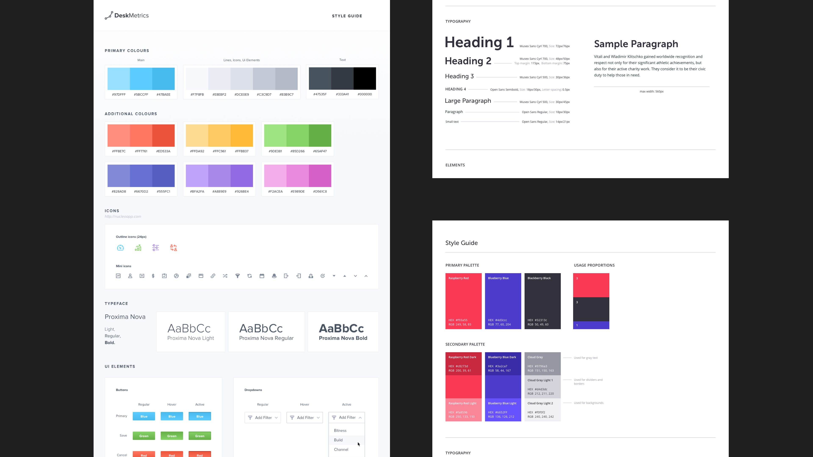

## 원자 설계(Atomic Design)가 적용된 설계 시스템 구축하기
잘 문서화된 설계 시스템은 어떤 주요 설계 프로젝트의 성공에 큰 역할을 할 수 있다. 이런 설계 시스템의 구축은 어떻게 접근해야 하는지에 대한 많은 방법들이 있다.
원자 설계는 설계 시스템을 구성하기 위해 최근에 제안된 방법론 중 하나이다.

나는 대규모 시스템를 위한 디자인과 개발에 주로 초점을 맞춘 회사에서 일한다. 우리는 지난 2016년 여름부터 *원자방식으로 접근하기 시작했다. 그 이후로, 우리는 여러 프로젝트에 이 방법론을 사용할 기회를 가졌다.
(과학에서 원자처럼 가장 작은 단위로 쪼개서 작업하는 방식)

이론적으로 원자방식은 잘 정의되어있지만, 디자이너와 개발자 둘 다 업무에 원자방식을 적용할 수 있는 실용적인 방법을 찾는데는 시간이 좀 걸렸다.

이 글에서, 필자는 원자방식으로 접근해서 일했던 우리의 경험을 이야기하고 싶다. 먼저 다른 일반적인 방법론과 비교해서 원자 방법론이 갖는 장점을 살펴볼 것이다. 그 후, 우리는 스케치나 인비전 같은 최신 UI 프로그램을 사용하여 디자이너의 관점에서 접근하는 방법을 배울 것이다.

### Part1.컴포넌트 기반 시스템
최초의 컴퓨터 이후로, 개발자들은 작업 속도를 높이고, 애플리케이션을 더 빨리 만들고, 오류 수를 줄이는 방법을 찾고 있다.

여기서 컴포넌트 기반 개발이 탄생했다. 이것은 여러 용도로 사용되는 코드 덩어리를 재사용할 수 있게 만드는 컴포넌트나 모듈을 기반으로 하는 방법론이다. 다시 말해서, 같은 코드를 두 번 작성할 필요는 없다. 또한 모듈을 한 번 수정하여 모든 인스턴스에서 업데이트되는 것을 볼 수 있으며, 보다 명확한 애플리케이션 아키텍처를 가지고 있으며, 일반적으로 통합된 개발 프로세스를 갖추게 된다.

그런 접근법은 개발에만 국한된 것이 아니다. 웹사이트를 설계할 때 두 가지 일반적인 접근법이 있다.

당신이 이름 들어본 Bootstrap, Materialize, Foundation 등의 프레임워크,그것들은 모든 버튼과 체크박스에서 패널과 아코디언에 이르기까지 재사용 가능하게 구성되어 있다. 개발자들은 이런 것들을 사용하면 시간과 노력을 매우 아낄수 있기 때문에 좋아한다. 드롭 다운 메뉴를 코딩할 시간에 사용할 컴포넌트를 선택하여 바로 테스트를 해보고 웹 사이트에 적용하면 된다. 하지만 이것은 많은 단점을 가질 수 있다.

1.디자이너를 위한 것은 아니다. 개발자들이 웹사이트를 빠르게 조합해서 만들 수 있도록 해주는 많은 프레임워크들이 있다. 하지만 이런 프레임워크들 중 몇개나 sketch파일이나 psd파일과 연동되거나 디자이너가 사용하는 프로그램에서 소스 파일이 연동이 가능한가? 프론트엔드 프레임워크들은 디자이너를 위해 만들어 지지 않았다.(프레임워크 이름부터 그렇지 않나)

2.프레임워크들은 어느 정도 커스터마이징을 허용하고 있다. 동시에 아이덴티티가 뚜렷히 차별화 되는 제품을 만들어야 한다면 단순히 버튼 색상을 바꾸는 것만으로는 부족할 수 있다. 딥하게 커스터마이징이 요구되는 많은 양의 추가 개발은 많은 노력을 필요로 하며 프레임워크 사용의 필요성 자체를 부정하게 된다.

3.프레임워크는 느리다. 프레임워크들은 개발자가 사용할 수 있는 많은 기능들을 가지고 있다. 그러나 모든 기능들에는 개발자에게 필요하지 않은 기능 또한 5개는 있을 것이다. 이것은 사용되지 않는 기능의 코드가 전체 성능에 부정적인 영향을 미친다는 것을 의미한다. 

이것의 요점은 일부 프로젝트에서는 관련이 없을 수 있지만, 약간 특별한 UI와 기능을 만들려고 할 때 프레임워크를 사용하는 것은 최선의 해결책은 아닐 수 있다.

스타일 가이드는 프로젝트에 작은 컴포넌트 기반 설계 시스템을 갖출 수 있는 일반적인 접근 방식이다. 당신의 모든 프로젝트에는 일종의 스타일 가이드가 있을 것이다. 당신은 그것을 스케치해서 mock-up을 만들고, mock-up에서 컴포넌트들을 만들어 빠르게 사용할 수 있다. 그러나 전형적인 스타일 가이드에도 결점이 있다.

1.구성요소의 상속 추적이 어렵다. 대규모 프로젝트가 하나 이상의 스타일과 크기, 입력칸 또는 다른 컴포넌트를 갖는 것은 드문 일이 아니다. 그리고 개발자가 당신의 mock-up을 검토할 때, 개발자들은 어떤 버튼을 사용해야 하는지 파악하는데 어려움을 겪을 것이다. 이건 또한 디자인 팀과도 관련 있는 일이다.

2.컴포넌트들중 다수는 스타일 가이드에 문서화되어 있지 않은 경우가 많다. 일반적으로 텍스트 스타일, 아이콘, 버튼, 드롭다운 등 일부 텍스트 스타일만 포함하고 있다. 자잘한 요소나 mock-up들은 적절한 문서화 없이 의도하지 않은 방식으로 구현되는 경우가 많다.

3.허접한 문서화는 당신이 설계한 컴포넌트의 재사용성도 크게 감소 시킬 수 있다. 만약 당신이 당신의 프로젝트에 12페이지 이상의 페이지를 가지고 있다면 문제가 된다. 당신도 팀의 다른 디자이너나 개발자가 항상 프로젝트의 모든 화면을 훑어보고 팝업이 이미 전에 만들어졌는지를 확인 할것이라고 기대하지 않을 것이다. 디자이너가 새로운 팝업을 만든다. 개발자는 새로운 팝업을 코딩한다. 그 다음에 당신도 알듯이, 프로젝트에는 간단한 예/아니요를 위한 10가지 팝업 스타일을 존재하게 된다.