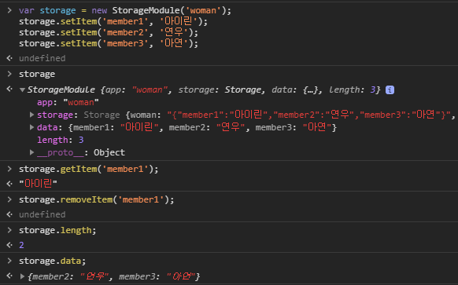
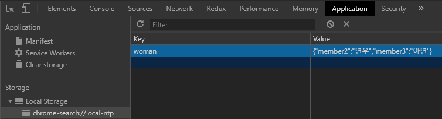

# Web Storage
- Origin(host:port) 단위로 관리된다.
- 객체와 매우 비슷(key-value 타입, iterator 미구현)
- local과 session 2가지 존재
- 배열처럼 length 구현(Array.prototype과는 별개)
- 모든 데이터를 문자화(toString)해서 삽입한다.(객체는 JSON처리 필요)
- 쿠키 역할 대체 가능(만료시간은 직접 구현해야 함)

## Web Storage와 Cookie와의 차이점

|항목|스토리지|쿠키|
|-|-|-|
|크기|5MB|4KB|
|유효기간|없음(직접구현)|있음|
|서버통신|없음|HTTP 헤더에 담아 송신|

## Local storage
- 창/탭 전반에 걸쳐 데이터 공유 가능
- 브라우저 닫아도 데이터 유지
- 삭제하지 않으면 데이터가 사라지지 않기에 같은 오리진에서 이름 충돌 가능성 有

## Session storage
- 창/탭간에 데이터 공유 불가
- 브라우저 닫으면 데이터 삭제

## 데이터를 설정/취득하는 방법
- 객체 방식과 동일
  - 취득: 점과 대괄호
  - 삽입: 점과 대괄호를 써서 대입
  - 삭제: delete 사용
- 메서드를 통한 방식(이 방식 추천 -> 일반 객체와 구분위함 )
  - getItem('키');
  - setItem('키','값');
  - removeItem('키'); / clear(); -> 일괄 삭제

```javascript
const storage = localStorage;

storage.member1 = '연우';
storage['member2'] = '아이린';
storage.setItem('member3', '아연');

console.log(storage.member1); // 연우
console.log(storage['member2']); // 아이린
console.log(storage.getItem('member3')); // 아연

delete storage.member1;
delete storage['member2'];
storage.clear();

const obj = {book1: '신곡', book2: '노르웨이숲', book3: '절권도'};
const arr = [1,2,3,4,5];
storage.setItem('obj', JSON.stringify(obj));
storage.setItem('arr', JSON.stringify(arr));
console.log(JSON.parse(storage.getItem('obj'))); // {book1: "신곡", book2: "노르웨이숲", book3: "절권도"}
console.log(JSON.parse(storage.getItem('arr'))); // [1, 2, 3, 4, 5]

// 객체와 문자열을 구분해서 순회
for(let i=0, len=storage.length; i<len; i++){
  let k=storage.key(i);
  if(storage[k].indexOf(',') > -1) console.log(k, JSON.parse(storage[k]));
  else console.log(k, storage[k]);
}
```

## 이름 충돌 방지
- 애플리케이션 개발이 커져서 스토리지를 많이 쓰다보면 이름 충돌 가능성이 생김.
- 클래스를 활용해서 애플리케이션 단위로 나눠서 해결 가능.
- 메서드 방식으로 데이터 핸들링 허용하게 만듬 (getItem, setItem, removeItem, clear)
- 세션 스토리지로 변경 가능(this.storage값을 sessionStorage로 변경)

```javascript
class StorageModule {
  constructor(app) {
    this.app = app;
    this.storage = localStorage; 
    this.data = JSON.parse(this.storage[this.app] || '{}');
    this.length = 0;
  }
  getItem(key) {
    return this.data[key];
  }
  setItem(key, value) {
    this.data[key] = value;
    this.storage[this.app] = JSON.stringify(this.data);
    this.length = Object.keys(this.data).length;
  }
  removeItem(key) {
    delete this.data[key];
    this.storage[this.app] = JSON.stringify(this.data);
    this.length = Object.keys(this.data).length;
  }
  clear() {
    this.data = {};
    this.storage.clear();
  }
}
```


