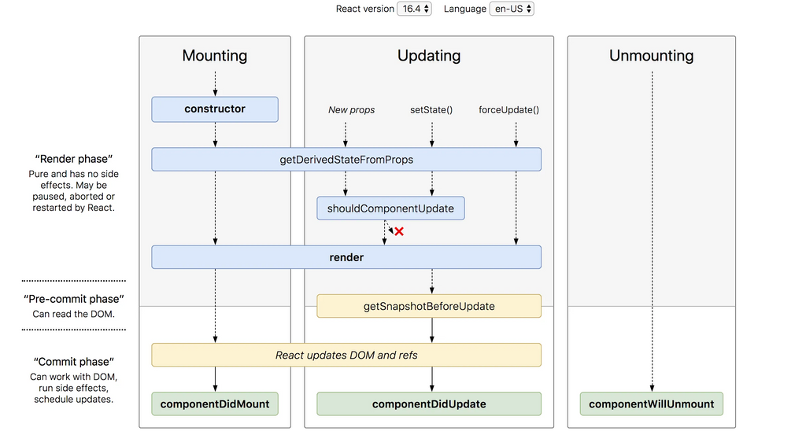

# 3.3 생명주기 메서드

모든 컴포넌트는 다음과 같이 세단계를 거친다.

- 초기화 단계
  - 최초로 컴포넌트 생성될 때 한번 수행
  - construtor()
  - render()
  - componentDidMount()
- 업데이트 단계
  - static getDerivedStateFromProps()
  - shouldComponentUpdate()
  - render()
  - getSnapshotBeforeUpdate()
  - componentDidUpdate()
- 소멸 단계
  - componentWillUnmount()
- 예외 상황
  - static getDerivedStateFromError()
  - componentDidCatch()

## construtor(props)
- 초기 속성값으로부터 상태값을 만드는 경우
- 다른 메서드에서 상태값을 변경할때는 setState()를 통해서만 가능
- but 요즘은 클래스필드가 표준이다.
  - state = {...}
- setState()는 마운트 이후 사용 가능하므로 construtor에서 사용X

```javascript
class MyComponent extends Component {
  // 클래스 필드 방식
  // state = { movie: this.props.age > 19 ? '조커' : '스파이더맨',}

  constructor(props) {
    super(props);
    this.state = {
      movie: props.age > 19 ? '조커' : '스파이더맨',
    }
  }
  render() {
    return (
      <>
        {this.state.movie}
      </>
    );
  }
}
```

## static getDerivedStateFromProps(props, state)
- 정적 메서드이므로 내부에서 this 접근 불가
- 속성값과 상태값을 이용해서 새로운 상태값을 만듬
- 시간에 따라 변하는 속성값으로부터 상태값을 계산하기 위해 추가
  - ex) 특정 요소의 y축 위치가 속성값일 때 스크롤 여부를 상태값으로 저장하는 용도
- render() 호출 직전 호출
- 이 메서드가 필요한 경우는 이전 속성값과 이후 속성값  양쪽에 의존적인 상태값이 필요한 경우
  - ex) isMovingFaster 상태값은 이전 속성값과 이후 속성값으로 계산되는 속성값이다.
```javascript
class MyComponent extends Component {
  state = {
    // 이전 speed를 저장하는 상태값
    prevSpeed: this.props.speed,
    isMovingFaster: false,
  };
  static getDerivedStateFromProps(props, state) {
    if(props.speed !== state.prevSpeed) { // 이전 speed와 현재 상태 speed가 같지 않으면 
      // 이전 speed를 현재 상태 speed로 변경하고 이전보다 빠른지 여부 반환
      return {
        isMovingFaster: state.prevSpeed < props.speed,
        prevSpeed: props.speed,
      };
    }
    return null;
  }
}
```

- 이 메서드 잘못 사용하는 경우
  - 속성값 변화에 따라 API 호출한 경우
    - this로 다른 메서드에 접근 불가능하기 때문에 componentDidUpdate()에서 하는 것이 맞다.
  - 속성값을 입력으로 하는 메모리제이션을 상태값으로 관리하는 경우
    - 상태값이 많아지면 코드가 복잡해지므로 render()에서 직접 처리하는 것이 낫다.

```javascript
import memoize from 'lodash/memoize';

class MyComponent extends Component {
  // products가 변경되는 경우에만 계산한다.
  getFilteredProducts = memoize((products) => {
    return products.filter(p => p.price < 1000);
  }); 
  render() {
    const { products } = this.props;
    const getFilteredProducts = this.getFilteredProducts(products);
    return (
      <table>
        {getFilteredProducts.map(v => (
          <tr>
            <td>{v.name}</td>
            <td>{v.price}</td>
          </tr>
        ))}
      </table>
    );
  }
}
```

  - 속성값이 변경될 때 상태값을 초기화하는 경우
    - 부모 컴포넌트에서 처리하는것이 낫다.

## render()
- 클래스 컴포넌트를 정의할 때 반드시 작성
- 지양할 사항들
  - 순수함수로 작성해야 하기 때문에 내부에서 setState 호출하면 안된다.
  - 부수효과(서버 통신, 쿠키에 저장등)를 발생시키면 안된다.
- 리액트 포털을 사용하면 컴포넌트의 현재 위치와는 상관없는 특정 돔 요소에 렌더링 할 수 있다.
  
```javascript
function Modal({title, desc}) {
   const domNode = document.getElementById('modal');
   return ReactDOM.createPortal(
     <div>
       <p>{title}</p>
       <p>{desc}</p>
     </div>,
     domNode,
   );
}
```

# componentDidMount()
- render가 되고 돔에 반영된 요소로 알 수 있는 값을 얻을 수 있다.
  - ex) div의 현재 가로 길이가 400이상인지에 따라 배경색 다르게 적용하는 경우

```javascript
class Box extends Component {
  state = { boxWidth: 0 };
  divRef = React.createRef();
  componentDidMount() {
    this.handleChange();
    window.addEventListener('resize', e => {
      this.handleChange();
    });
  }
  handleChange() {
    const rect = this.divRef.current.getBoundingClientRect();
    this.setState({ boxWidth: rect.width });
  }
  render() {
    const { boxWidth } = this.state;
    const backgroundColor = boxWidth < 400 ? 'red' : 'blue';
    return (
      <div ref={this.divRef}
        style={{ width: '100%', height: '100px', backgroundColor }} >
        {boxWidth}
      </div>
    );
  }
}
```

- API 결과를 빠르게 받아와서 처리하기 위해서는 construtor()에서 API호출을 하고 componentDidMount()에서 setState()를 하면 된다.
  - 허나 속도차이 얼마 안나고 소스 복잡해지므로 이 방법 비추
```javascript

class APIComponent extends Component {
  constructor(props) {
    super(props);
    this.dataPromise = requestData();
  }
  componentDidMount() {
    this.dataPromise.then(data => this.setState({ data }));
  }
  render() {
    return ( ... );
  }
}
```

## shouldComponentUpdate
- 138페이지 할 차례

```javascript
```

```javascript
```

```javascript
```

```javascript
```

```javascript
```

```javascript
```

```javascript
```