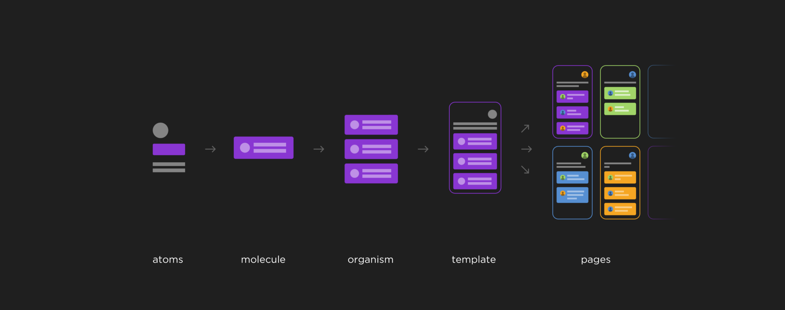

### 제2부 원자 설계(Atomic Design)란?
만약 당신이 프런트 엔드 프레임워크와 스타일 가이드의 장점만 뽑아와 사용할 수 있다면 어떻게 하겠나? 그 해결책들 중 하나가 바로 원자 설계로, 미국 Pittsburgh의 웹 디자이너인 Brad Frost에 의해 제안되었다.

원자 설계는 당신의 설계 시스템의 모든 컴포넌트를 설명하고 체계화할 수 있는 방법론이다.

- 파파고 참고해서 이어서 번역하기
https://medium.muz.li/building-design-systems-with-atomic-design-93a13286f676