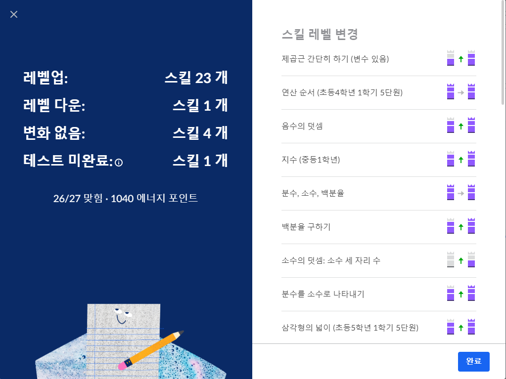

# [Algebra basics] basic
- 범위: 초등4학년~중등3학년
- 기초 대수학때 다뤘던 내용들이니 복습개념으로 공부.

## 음수(negative number)  
- 음수로 사칙연산 파트

## 절댓값(Absolute Value)
- 음수도 양수도 치환
- |수| 로 표현

## 지수(exponents)
- 지수: 작은 숫자
- 밑: 지수 밑에 있는 숫자
- 지수는 밑수를 몇 번 곱해야 하는지 나타내는 수
- 4³ = 4·4·4

## 제곱근(square root)
### 분수의 제곱근 간단히 하기
- √(1/200) -> 1/(10√2) -> 1·√2/(10√2)·√2 = √2/20
- -√40 + √90 -> √4·10 + √9·10 -> 2√10 + 3√10 = √10
- √180 · √(1/2) -> √(180·1/2) -> √90 = 3√10
- √(56z⁷) -> 2√{14·(z³)²·z} = 2z³√{14z 

## 반지름, 지름, 원주, 파이
- 반지름(raius) 
- 지름(diameter)
- 원주(circumference) : 원의 둘레
- 파이(π): 원주와 지름 사이의 비율
- 반지름이 3인 원의 원주 -> 3·2·π -> 6π
- 원주가 10인 원의 지름 = 10/π
- 원주가 50.24인 원의 넓이 -> (50.24/π/2)^2*π = 200.858121844

