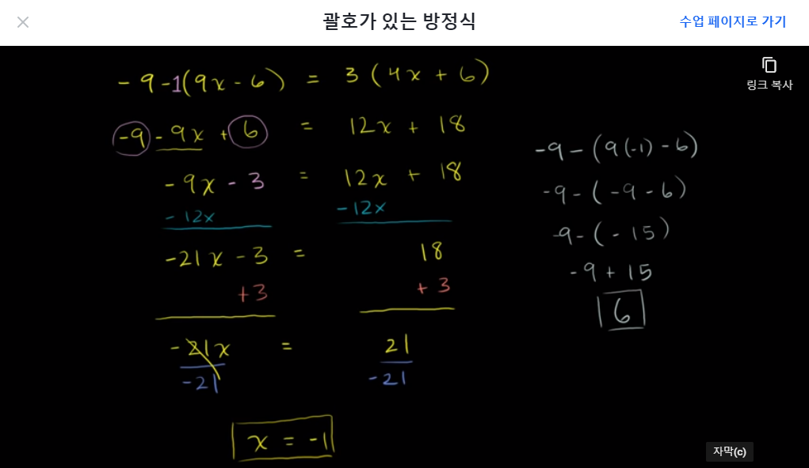
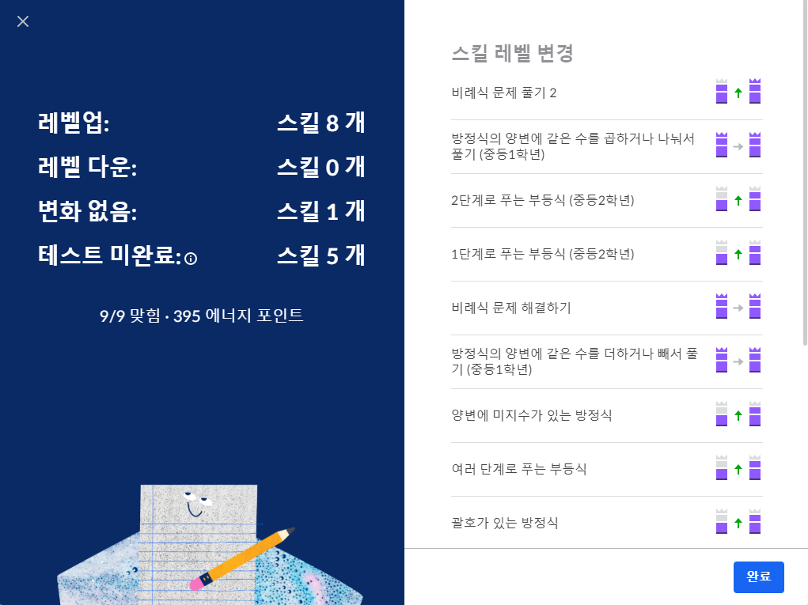

# [Algebra basics] 일차방정식과 일차부등식

## 2단계로 푸는 방정식(Two-step equations)
- 수확철이 시작할 때 쯤 맥도날드는 오렌지 나무 5 그루를 베었습니다. 나무 한 그루당 오렌지가 210개 열리고, 남은 나무에서 오렌지가 총 41790개 열렸습니다.
  - 처음에 있던 오렌지 나무의 그루 수(t)를 구하는 식 
    - t-5 = 41790/210
  - 처음에 오렌지 나무 = 210 그루

## 여러 단계로 푸는 방정식(Multi-step equations)

## 여러 단계로 푸는 부등식(Multi-step )
- 부등식을 음수로 곱하거나 나눴을 때, 부등호의 방향은 역방향으로 변경
  - 14−3x < −1
  - −3x < −15
  - x > 5
- x의 -2배보다 7 작은 수는 41보다 크거나 같습니다.
  - 부등식 -2x-7 ≥ 41
  - 해 x ≤ -24

- 엘리오는 길이가 14cm인 초를 만들었습니다. 각 초는 다 타는데 8시간이 걸립니다. 엘리오는 21cm 길이의 초가 다 타는데 얼마나 걸리는지 구하려고 합니다.
  -  A 초의 크기/ B 초의 크기 
 = A초가 다 타는 시간 / B초가 다 타는 시간
  - 21/14 = h/8
  - 8·(3/2) = h
  - 12 = h
​	
