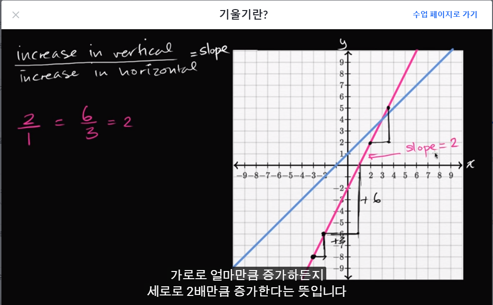
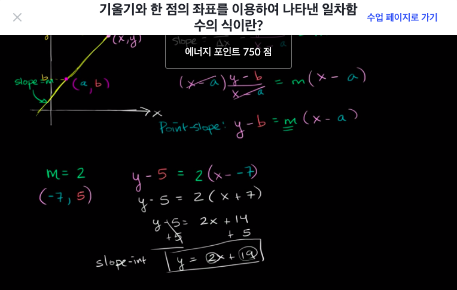
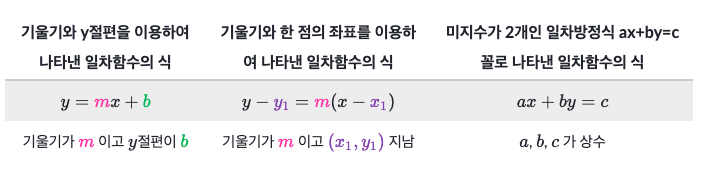
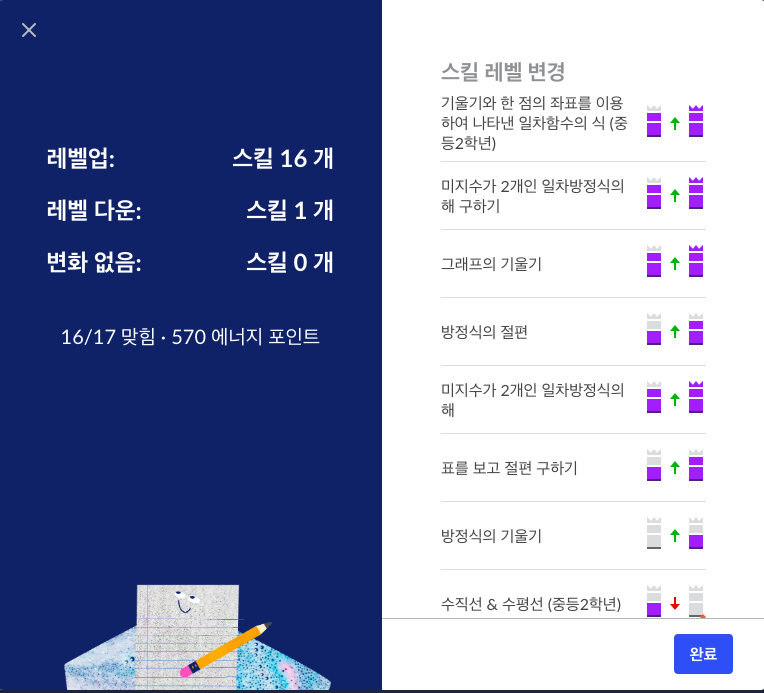

```완전 처음하는 과목```
# [Algebra basics] 직선과 기울기 그리기

## 좌표평면
- 좌표평면에 x축 y축 표시하는 것

## 변수가 두 개인 일차방정식의 해
- 6x+7y=4x+4y
  - y가 -4라면 x는?
  - 6x-28=4x-16
  - 2x=12
  - x=6

## 절편이란?
- x절편(x-intercept)
  - x축이랑 만나는 점 = x축의 y좌표는 0
  - 즉 y가 항상 0이 됨
- y절편(y-intercept)
  - y축이랑 만나는 점 = y축의 x좌표는 0
  - 즉 x가 항상 0이 됨
- 5x + 6y = 30
  - 각각 x와 6에 0을 넣어보면 됨
  - x=0, y=5
  - y=0, x=6

## 기울기란?(Slope Introduction)
- 기울기: 직선이 기울어진 정도
- Δy/Δx (x가 분모!)
- 삼각형 기호의 명칭은 델타
  - 변화량을 뜻함


- 두 점을 이용해 기울기 구하기
  - start: x=11.4 y=11.5
  - end: x=12.7 y=15.4
  - (15.4-11.5)/(12.7-11.4)
  - 3.9/1.3 = 3

### 표를 보고 절편 구하기
x |	y
--|--
14|-5
21|-3
28|-1

- x가 7 증가할때 y는 2증가함

x |	y
--|--
 0|-9
 7|-7
14|-5

- y절편 : (0, -9)

 x | y
----|---
 28 | -1
31.5| 0
 35 | 1

- x절편 : (31.5, 0)

## 수직선 & 수평선 (중등2학년)
- 수평선의 방정식은 y=k(y값)
- 수평선의 기울기는 항상 0
- 수직선의 방정식은 x=k(x값)
- 수직선의 기울기는 항상 정의되지 않습니다.

## 기울기와 y절편을 이용하여 나타낸 일차함수의 식이란?(Slope intercept from)
- y=2x+3
  - y는 상수와 x의 곱에 다른 상수가 더해진 형식
  - y절편과 기울기를 구하는것이 쉽기에 붙은 명칭
  - x에 0을 대입하면 상수만 남으므로 y절편은 (0, 상수)
  - x가 증가할때마다 y는 3씩 증가하므로 x의 계수가 기울기

 x | y
---|---
 0 | 3
 1 | 5 (3+2)
 2 | 7 (3+2+2)
 3 | 9 (3+2+2+2)

- y절편이 (0,6)이고, 기울기가 3인 직선의 방정식은?
  - y=3x+6

## 기울기와 y절편을 이용하여 나타낸 일차함수의 식 그리기

## 기울기와 y절편을 이용하여 나타낸 일차함수의 식 쓰기
- 점 (0,3)과 (2,7)을 지나는 직선을, 기울기와 y절편을 이용하여 일차함수의 식으로 나타내기
  - 기울기와 y절편을 이용하여 나타낸 일차함수의 식 y= mx + b
  - 위 식에서 기울기는 m, y절편은 b.
  - 기울기: 직선 위에 있는 임의의 두 점 사이에서 x값의 증가량에 대한 y값의 증가량의 비
  - (7-3)/(2-3) = 2
  - y = 2x + 3

## 기울기와 한 점의 좌표를 이용하여 나타낸 일차함수의 식(Point-slope from)
- y - b = m(x-a)
  - m은 기울기
  - (a,b)는 직선이 지나가는 점의 좌표
  - 기울기 먼저 구하고 a,b에 좌표 대입하면 끝



## 미지수가 2개인 일차방정식 ax+by+c=0꼴로 나타낸 일차방정식이란?(linear equation standard form)
- ax + by = c

## 요약: 미지수가 2개인 일차방정식


