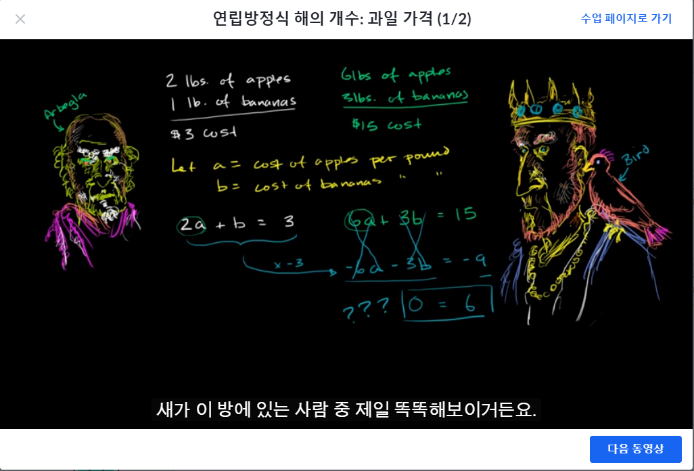

```완전 처음하는 과목```
# [Algebra basics] 연립방정식(System of equation)

## 연립방정식이란? (그래프를 이용하여 푸는 법)
- 방정식을 이용해서 점 2개를 구한뒤 그래프를 그리는 것을 두번한 뒤 두 선이 겹치는 좌표를 구하는 방법
- y = -4x - 3
  - 기울기와 y절편을 이용하여 나타낸 일차방정식
  - y = 기울기x + y절편
  - y절편은 x에 0을 대입해보면 (0, -3)
  - 기울기가 -4이므로 x에 +1 y에 -4을 하면 (1, -7)
- y = -2x + 1
  - y절편은 (0, 1)
  - 기울기가 -2이므로 (1, -1)
- −7x−2y=14
  - 미지수가 2개인 일차방정식 
  - ax + by = c
  - (0, -7), (-2, 0)
- 6x+6y=18
  - (0, 3), (3, 0)
​	
## 연립방정식 가감법(elimination)
- 500명 어른들과 300명 아이들이 3100개 빵을 먹었고, 500명 어른들과 200명 아이들이 2900개 빵을 먹을수 있다.
- 이 때 어른 한명과 아이 한명이 먹는 빵 갯수 구하기
  - 똑같은 값을 양변에서 뺀다.
  - 결국 두개의 연립방정식을 빼서 한쪽의 값을 구하는 방식이 됨
  - 500a + 300c = 3100와 500a + 200c = 2900
  - 왼쪽에서 오른쪽을 빼주면 100c = 200 -> c = 2
  - 500a = 2500 -> 100a = 500 -> a = 5
- x-4y=-18 과 -x+3y=11
  - 왼쪽식과 오른쪽식을 더하면 y만 남는다는 사실 이용
  - x=10 y=7


## 연립방정식 대입법
- 둘 중에 하나의 식의 값이 있다면 다른 식에 그 값에 해당하는 식을 대입한다.
- -3x-4y=-2 & y=2x-5
  - 왼쪽식의 y부분에 오른쪽 y식을 대입한다
  - -3x-4(2x-5)=-2
  - -3x-8x+20=-2 -> -11x=-22 -> x=2
  - 구한 x값을 x에 대입해서 y를 구한다
  - y=4-5 -> y=-1

## 연립방정식의 해의 개수

  - 아 빵 터졌다.

- 해를 갖는 연립방정식(consistent)과 해가 없는 연립방정식(inconsistent)
  - 그래프에 그렸을때 두개의 선이 만나지 않으면 inconsistent
- 해가 하나인 연립방정식과 해가 무수히 많은 연립방정식
- 5x-9=16 & 5x-9=36의 해의 갯수
  - 0=-20 -> 해가 없음(no solutions)
- -6x+4y=2 & 3x-2y=-1의 해의 갯수
  - 0=0 -> 해가 무수히 많다(Infinitely many solutions)

