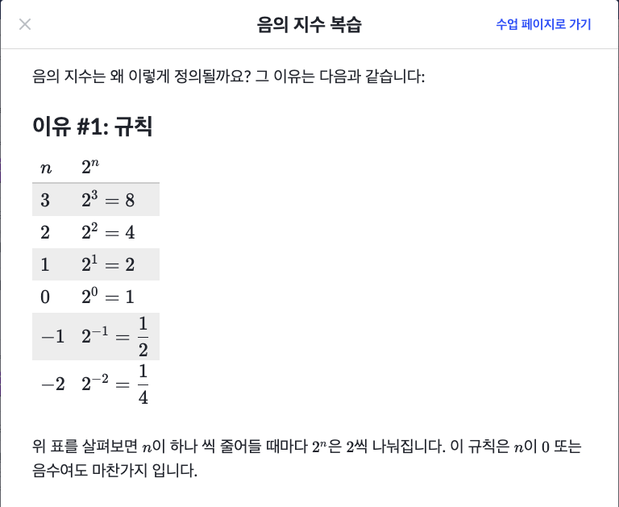
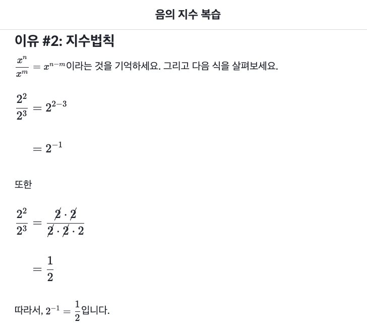
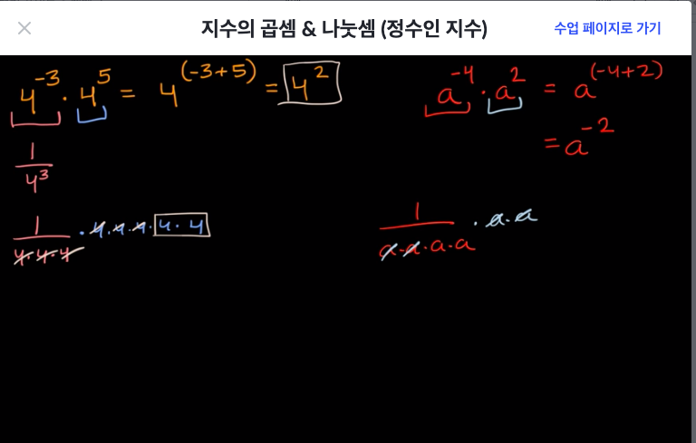
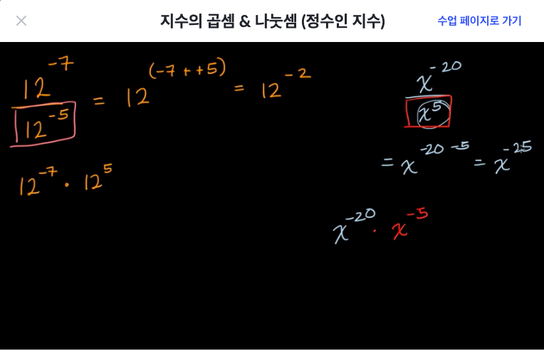
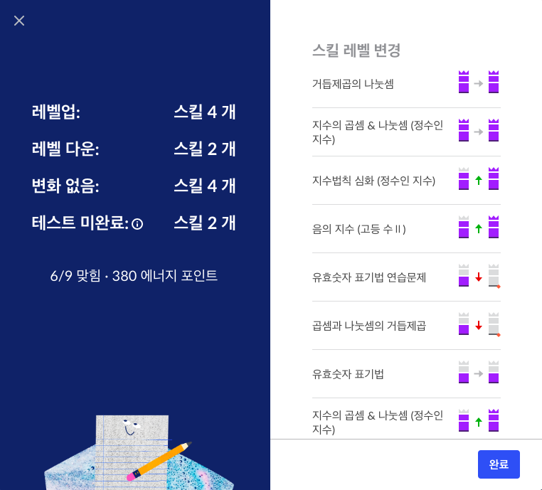

# [Algebra basics]

## [복습] 음의지수 복습

## [복습] 지수의 곱셈 & 나눗셈 (정수인 지수)

- 4^10
  - = (4^5)^2
  - = (4^20)/(4^10)
  - = (4^2·4^3)^2

## 유효숫자 표기법(scientific notation)
- 어떤 수 a와 10의 거듭제곱의 곱으로 나타낸다.
- 어떤 수 a는 1보다 크거나 같고 10보다 작다.
- 0이 아닌 첫번째 자릿값을 찾아 소수점 왼쪽에 놓는다.
- 10의 거듭제곱의 형태로 곱해서 원래숫자와 같은 값을 만든다.
- 한마디로 a · 10^x 형태로 만드는 것

