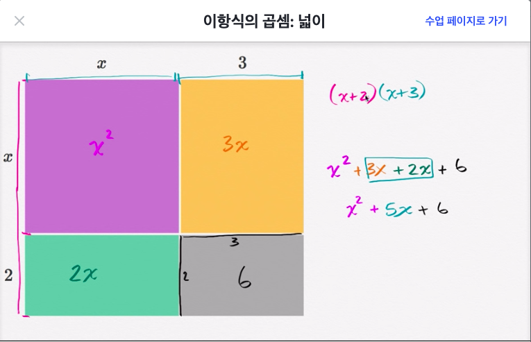
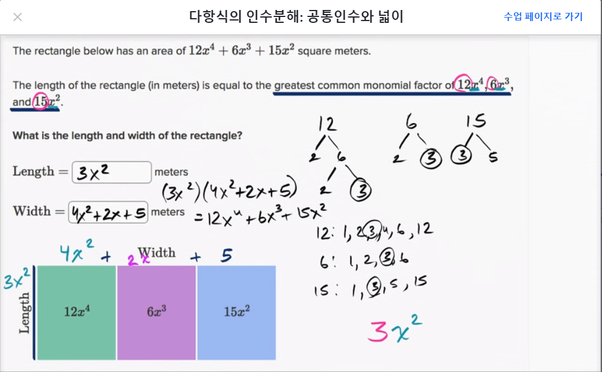
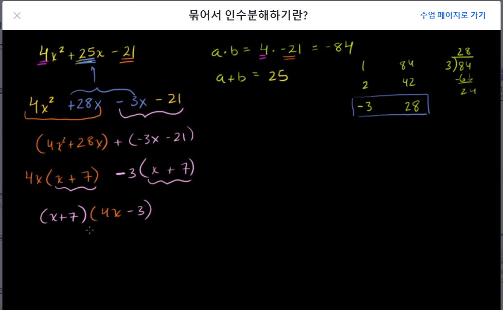
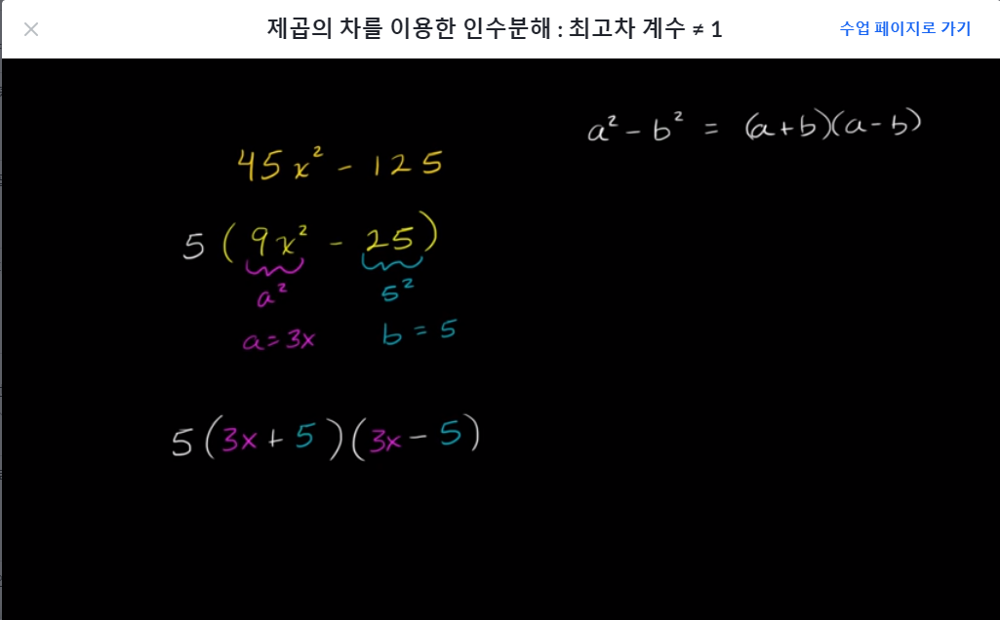
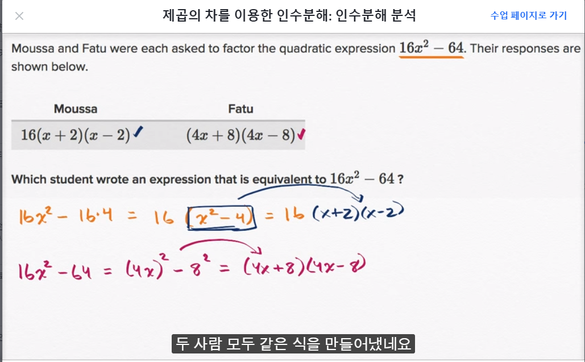
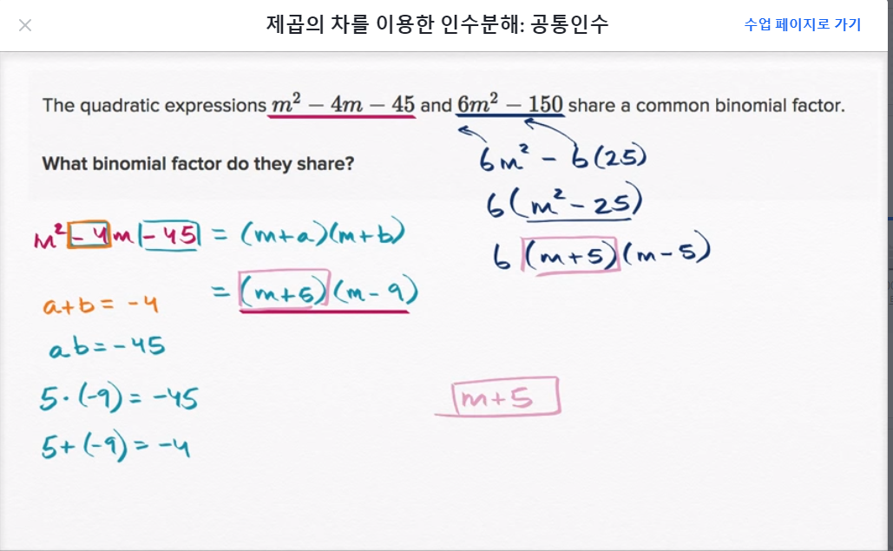
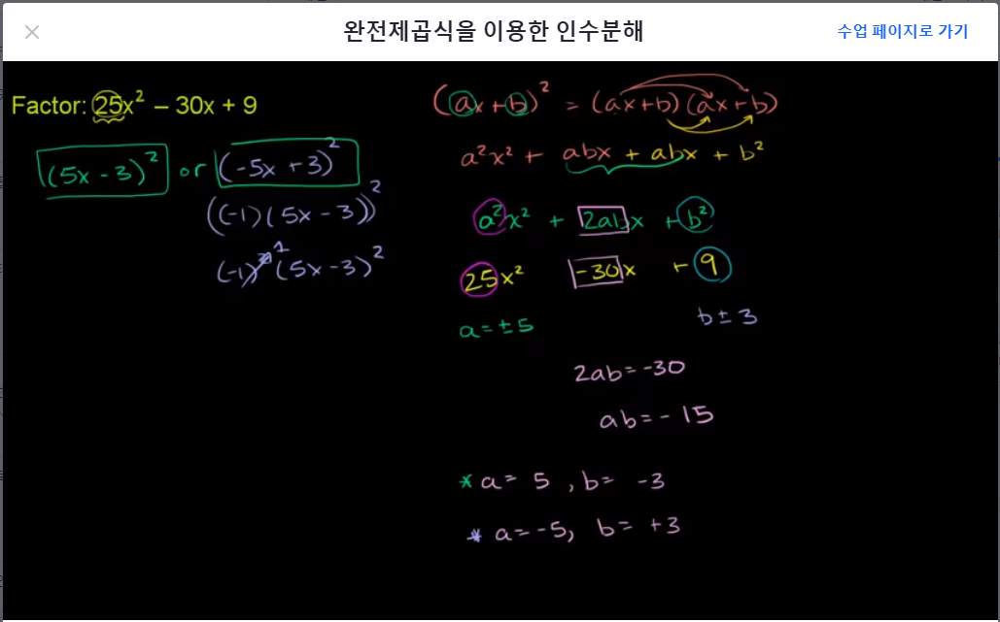
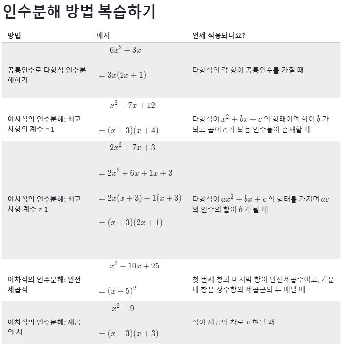

```완전 처음하는 과목```
# [Algebra basics]
## 다항식의 덧셈과 뺄셈
- 지수가 같은 값끼리 연산해서 정렬해서 쓰기

## 이항식의 곱셈
- 단항식과 다항식을 곱할 때에는 분배법칙 사용
- 지수끼리 곱해주는것은 지수의 덧셈이라는 것을 기억할 것
  - x² · x² = x⁴

- 두개의 이항식으로 표현하는 방법과 하나의 삼항식으로 표현하는 방법



- (3x + 2)(5x - 7) 푸는 방법 2가지
- 1.FOIL(First Outside Inside Last) 방법 사용
  - First  : 첫항끼리 곱    3x·5x
  - Outside: 바깥쪽항끼리 곱 3x·-7
  - Inside : 안쪽항끼리 곱  2·5x
  - Last   : 마지막항끼리 곱 2·-7
  - 3x·5x + 3x·-7 + 2·5x + 2·-7
  
- 2.분배법칙(이것만 기억하면 됨)
  - 3x(5x-7) + 2(5x-7)
  - 3x·5x + 3x·-7 + 2·5x + 2·-7 (결국 위와 같아짐)

- 답은 둘다 15x²-11x-14

## 특정한 형태의 이항식의 곱셈
- (x+a)(x-a) 꼴의 곱셈
  - a가 어떤 값이든 ax-ax로 소거됨
  - 답은 항상 x² - a² 형태

- (x+a)² 꼴의 이항식의 곱셈
  - (x+a)(x+a) -> x² + 2ax + b²
  - (x-3)²
    - x²-6x+9

## 공통 인수로 다항식 인수분해하기
- 다항식을 인수분해하는 것은 두 개 이상의 다항식의 곱으로 나타내는 것이다.
- 먼저 최대공약수(GCF)부터 구해서 상수를 추출한다.
- 중복되는 미지수항을 추출한다.
- 6x³+8x²−4x = 2x(3x²+4x-2)

### 다항식의 인수분해: 공통인수와 넓이



### 다항식의 인수분해: 이항식인 공통인수
- 괄호안의 값이 같다면 결국 곱과 같음
- n(n-1) + 3(n-1) = (n-1)(n+3)


## 이차식의 인수분해 1

(x+b)로나타내기.png)

- 이차식을 인수분해 하여 (x+a)(x+b)의 꼴로 나타내기
  - 최고차항의 계수가 1인 이차방정식의 인수분해
  - **x² + bx + c** 
    - x² + (m+n)x + m·n과
    - b=m+n c=m·n 를 만족할때
    - (x+m)(x+n)으로 인수분해 가능


## 이차식의 인수분해 2



### 최고차항의 계수가 1이 아닌 이차방정식의 인수분해
- fhX = fjX +ghX + gj
  - 그림을 보면 x²항의 상수 4와 -21을 곱하면 -84가 나온다.
  - X항의 상수 25는 -84를 인수분해 한 수의 합이여야 한다.
  - -3과 28은 합은 25이며 곱은 -84이므로 이 조건에 일치한다.
  - 25x는 28x와 -3x로 나눌수 있으며 공통항을 추출해내면 끝. 

- ax² + bx = c
  - 곱하면 ac이고 더하면 b가 되는 두 수를 찾는다.
  - 두수를 이용하여 x항을 분할한다.
  - 이차식을 묶어서 인수분해 한다. 

- 3x² + 10x + 8
  - 6, 4 곱하면 24(3·8) 더하면 10이므로 일치
  - 3x² + 6x + 4x + 8
  - 3x(x+2) + 4(x+2)
  - (3x+4)(x+2)


## 이차식의 인수분해: 제곱의 차
- 제곱의 차 형식으로 나타낼 수 있는 모든 다항식은 아래 공식을 적용해서 인수분해가 가능하다.
  - **a²-b² = (a+b)(a-b)**



- 처음 상수의 형태가 제곱 형태로 표현이 불가능한 경우
  - 먼저 공통의 상수를 추출했을때 상수부분이 제곱으로 표현이 가능하다면 (a+b)(a-b) 형태로 변경할 수 있다.



- 공통상수를 빼던 제곱 형태로 처리하던 값은 같다.



- 인수분해를 하면 두개의 식의 공통인수를 추출해 낼수 있다.


## 이차식의 인수분해: 완전제곱식
### 완전제곱식을 이용한 인수분해
- 완전제곱식의 이항식을 전개할 때는 다음 공식을 따른다.
  - (a+b)² = a² + 2ab + b²
  - (a-b)² = a² - 2ab + b²



### 완전제곱식을 이용한 인수분해: 공통인수
- **(Ax+B)² = (Ax)² + 2ABx + B²**
  - 16x³ + 24x² + 9x
  - x(16x² + 24x + 9)
  - x(4x² + 2·4·3x + 3²)
  - x(4x+3)²

### 완전제곱식을 이용한 인수분해: 음의 공통인수
- **(a+b)² = a² + 2ab + b²**
  - -4t² - 12t - 9
  - -1(4t² + 12t + 9)
  - -1(2t + 3)²

### 인수분해 방법 복습



- 질문 1: 공통인수가 존재하는가?
  - 공통인수를 밖으로 묶어 빼낸다.
- 질문 2: 식이 제곱의 차로 표현되었나? ex) x² - 16
  - a²-b² = (a+b)(a-b) 이용
- 질문 3: 식이 완전제곱식인가? ex) x² - 10x + 25
  - a² ± 2ab + b² = (a ± b)² 이용
- 질문 4:
  - a) x² + bx + c 꼴의 표현이 존재하면 b)로 이동.
  - b) 합이 b 가 되고 곱이 c 가 되는 인수들이 존재하나요?
    - 맞으면 합과 곱을 이용해서 인수분해. 아니라면 더 이상 인수분해 불가
- 질문 5: 합이 b가 되는 ac의 인수들이 존재하는가?


## 인수분해를 이용하여 이차방정식 풀기 

