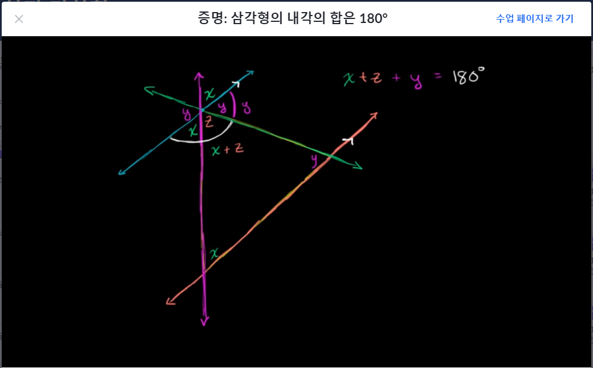
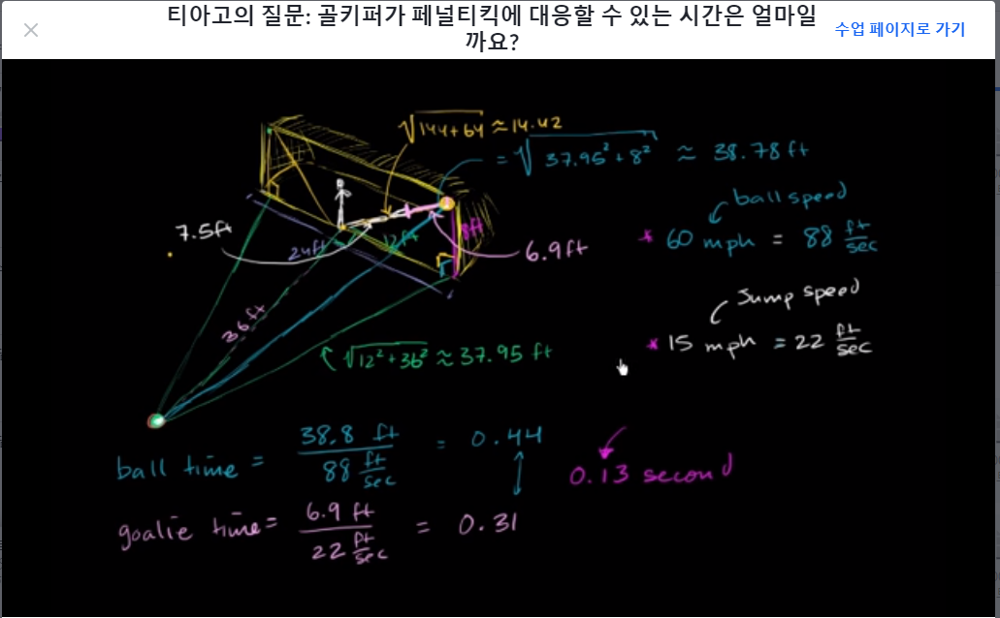

```완전 처음하는 과목```
# [Algebra basics] 방정식과 기하학
## 방정식 & 기하학
- 도형의 각도, 선분의 길이 이용해서 방정식 구하는 것임
- 단순 연산이라 정리 안함

## 삼각형의 각

- 삼각형의 두개의 꼭지점을 지나가는 선과 다른한점에서 그 선과 평행이 되는 선을 긋는다.
- 맞꼭지각의 크기는 같다는 사실을 이용해 계속 구하면 결국 세 각의 합은 180도라는 결론이 나온다.
- 어릴 때 그냥 외웠던 것 같은데 증명과정보니 신기하다.

## 피타고라스 정리(Pythagorean Theoreon)
- 직각삼각형에서 두변의 길이를 안다면 항상 세번째 변의 길이를 알아낼 수 있다.
- 빗변(hypotenuse):가장 긴 변이자 직각 반대편에서 마주보고 있는 변 
- 변1² + 변2² = 빗변²
- 피타고리스의 정리는 일상생활에 있는 다양한 것들에 적용할 수 있다.



## 삼각형의 닮음이란? 

## 삼각형의 닮음을 이용한 문제

