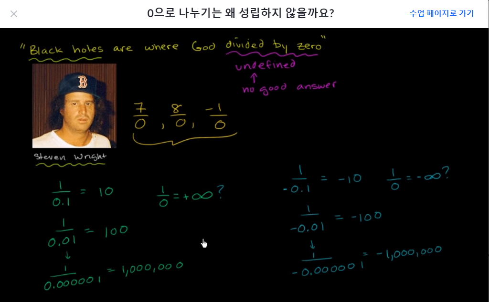
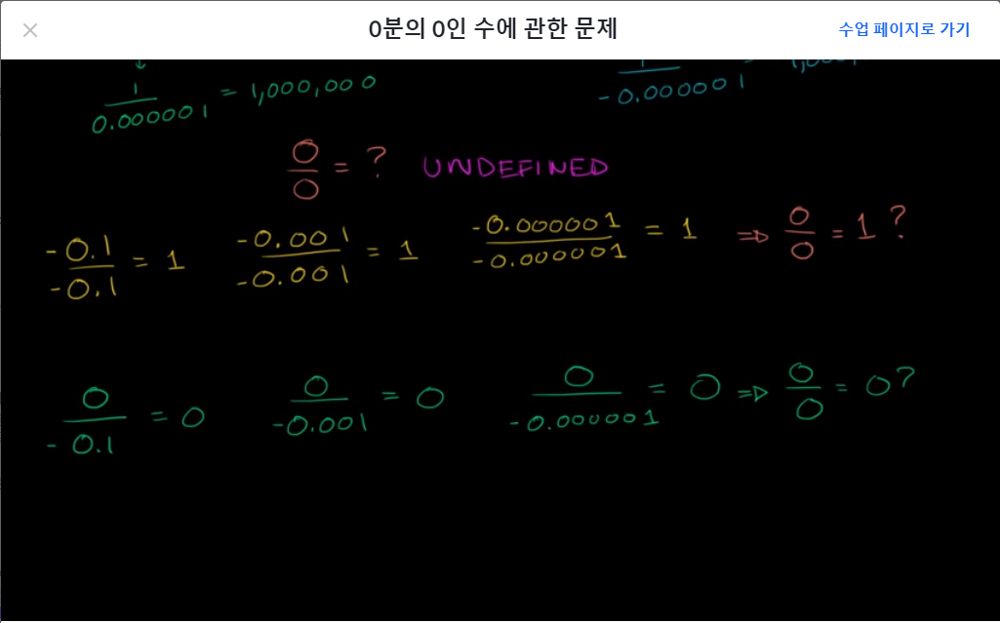
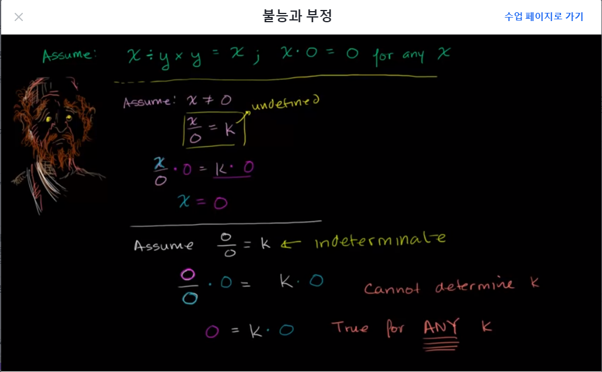

# [Algrebra] 대수학 기본
## Algrebra
- al-Kwarizimi가 쓴 책에서 유래한 명칭
- 방정식에서 음의 항을 소거한다는 뜻
- A.D(Anno Domini): 예수 그리스도의 해
- B.C(Before Christ): 기원전

### Abstract
- 추상성, 추상적인, 요약, 요약하다, 다른사람의 생각에서 본인의 생각을 끌어내다

## 좌표평면이란?
- 르네 데카르트(Rene Descartes)
  - 수학자이자 철학자
  - "I think; therefore I am."
    - 나는 생각한다. 고로 존재한다
  - "You just keep pushing. You just keep pushing. I made every mistake that could be made. But I just kept pushing."
    - 계속 나아가라. 나는 할수 있는 모든 실수를 다 저질렀었다. 그러나 계속 나아갔다.
  - 데카르트 이전의 기하학은 유클리드 기하학이라고 부른다.
  - 좌표평면에서 x,y를 관례적으로 사용해서 데카르트 좌표를 고안했다.
  - <U>좌표평면으로 대수학과 기하학의 관계를 이었다.</U>
    - 좌표를 이으면 결국 선이 되므로!

## 왜 대수학에서 문자를 사용할까요?
- 미지수가 있을 때, 미지수를 알수 없기 때문에 뭔가 대체해서 적을 것이 기호가 필요한데 그것을 문자로 표현할 뿐
  - 문자를 사용하는 것이 관계를 
  
  더 명쾌하게 표현하기 좋다.

## 0으로 나누기

- 나누는 수가 0에 가까울 수록 계산한 결과가 점점 더 커진다.
  - 나누는 수가 0에 가까운 **양수**이면 양의 무한대
  - 나누는 수가 0에 가까운 **음수**이면 음의 무한대
- 음의 무한대와 양의 무한대는 정반대의 값이다.
  - 0으로 나눈 결과 값은 하나가 아니다?!
- 이렇듯 양의 무한대이면서 음의 무한대일 수는 없으므로 결론은 undefined

- 0을 0으로 나누면 1이 된다는 주장
- 0을 0에 가까운 양수 혹은 음수로 나누면 0이 된다는 주장
- 결국 undefined

### 불능과 부정 (undefined & indeterminate)

- 가정과 모순이 되는 경우는 정의할 수 없으므로 undefined
- 가능한 경우가 한정되지 않는 것은 유일한 답이 없으므로 indeterminate

