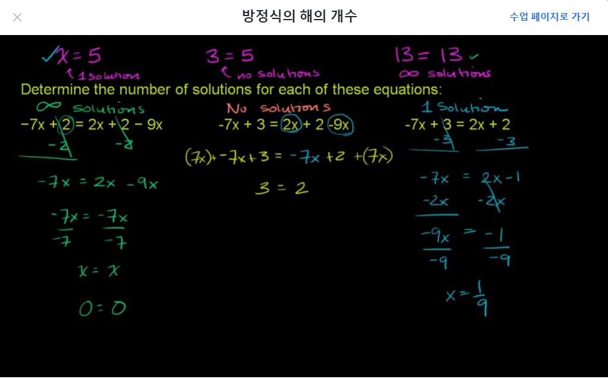
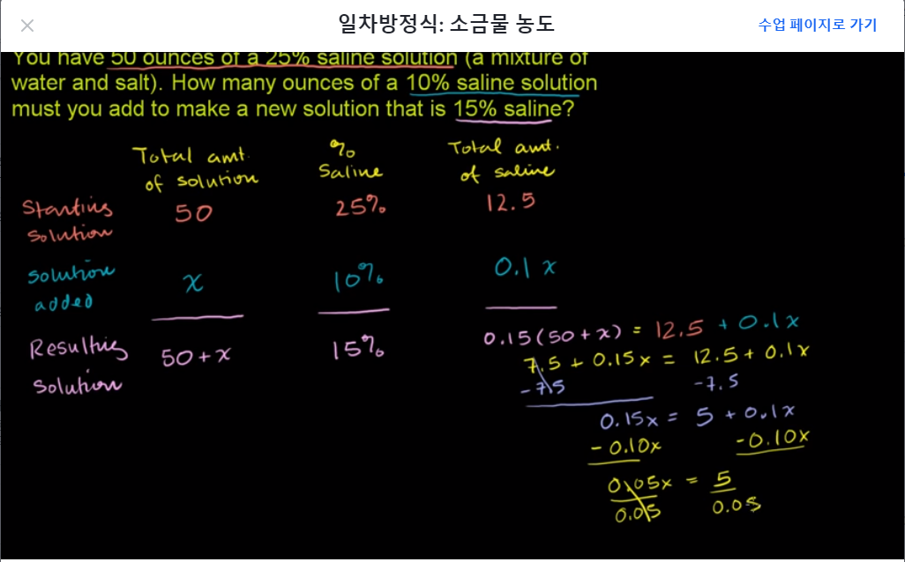
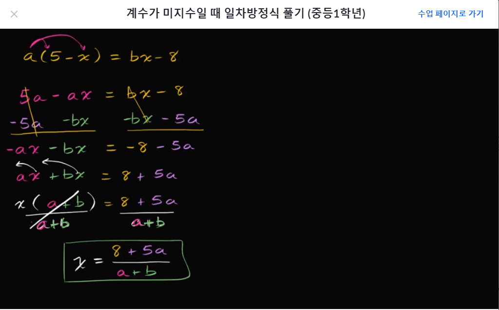
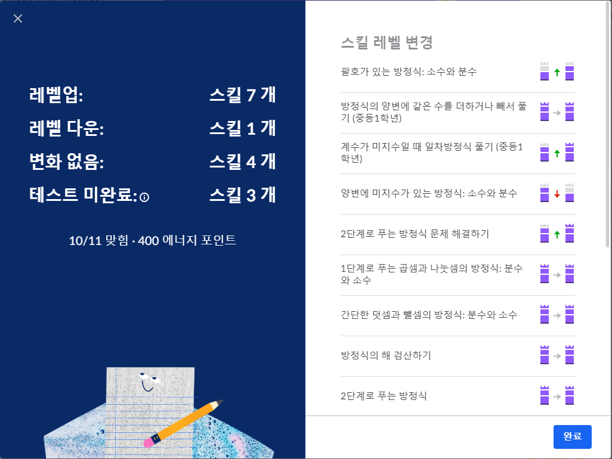

# [Algrebra]
## 일차방정식의 해의 개수 구하기
- ax + b = cx + d
  - 해가 1개인 경우 : a ≠ c
  - 해가 없는 경우 : a = c 이고 b ≠ d
  - 해가 무한한 경우 : a = c 이고 b = d

## 일차방정식 문제 해결하기 
### 연속한 정수의 합
- 연속한 홀수의 합이 136일때 홀수 찾기
  - 끝자리가 1, 3, 5, 7 혹은 3, 5, 7, 9라는 것이다.
  - 전자던 후자던 x, x+2, x+4, x+6 이다.
  - x + x+2 + x+4 + x+6 = 136
  - x = 31
  - [31, 33, 35, 37]

### 일차방정식: 소금물 농도

- x= 100이 나오므로 15% 소금물은 150온스이며 22.5온스 소금이 들어있다.

## 계수가 미지수일 때 일차방정식 풀기 

