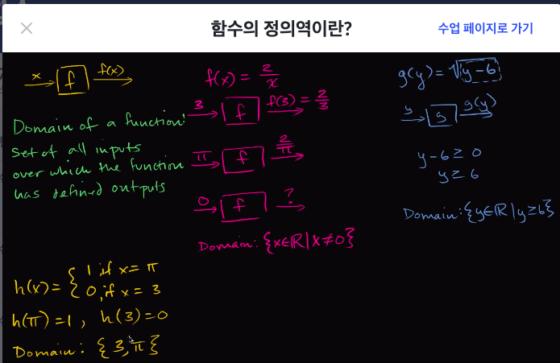
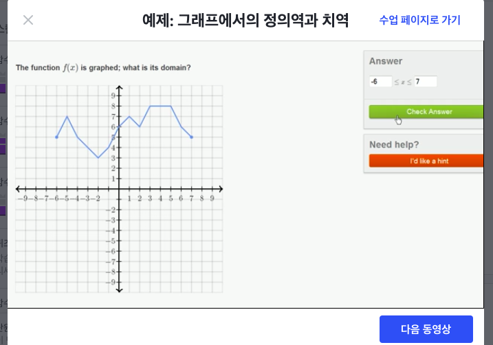
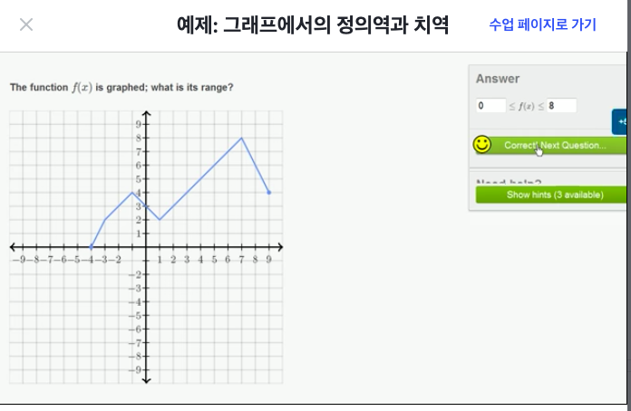

## 함수의 정의역이란?
- R: 실수(Real Numbers)
- 정의역: 결과가 정의된 함수의 대입값들의 집합
  - Domain : the set of all valid inputs
- g(y) = √(y-6)
  - 음수가 나오지 않는 한 y를 넣었을때 g(y)라는 값이 나온다
    - 음수이면 루트 연산자의 원칙이 정의되지 않음
  - y-6은 0보다 크거나 같음 (y-6 ≥ 0)
  - 즉 y는 6보다 크거나 같음 (y ≥ 6)
  - 정의역 : {y ∈ R| y ≥ 6}

- 함수의 정의역에 신경써야 하는 이유
  - 함수가 모든 실수, 정수, 양수, 음수의 부분집합에 대해 정의되지 않고 제외되는 것이 있기 때문

## 함수의 치역이란?
- 이번껀 한글 자막이 없어서 영어로만 강의를 들어서 대충 이해한거 같다.
- 치역 : 가능한 모든 출력값들의 모음
  - Range: the set of all possible outputs
- f(x) = x²
  - 정의역 : 모든 실수
  - 치역 : {f(x) ∈ R | f(x) ≥ 0}
    - f(x)는 0보다 크다

## 예제: 그래프에서의 정의역과 치역

- 위 그래프에서는 x가 -6일때부터 7일떄까지 정의되어있음
- 그래프에서 선이 없는 부분은 정의되지 않은 것
  - x가 -8일때 보면 선이 없으므로 f(-8)은 undefined
- 정의역: -6 ≤ x ≤ 7
  - 그래프에서 정의역은 x값의 범위 구한다고 생각

- 위 그래프에서 y가 가장 작은 값은 0이고 가장 큰값은 8임
- 치역: 0 ≤ x ≤ 8
  - 그래프에서 치역은 y값의 범위를 구한다고 생각

