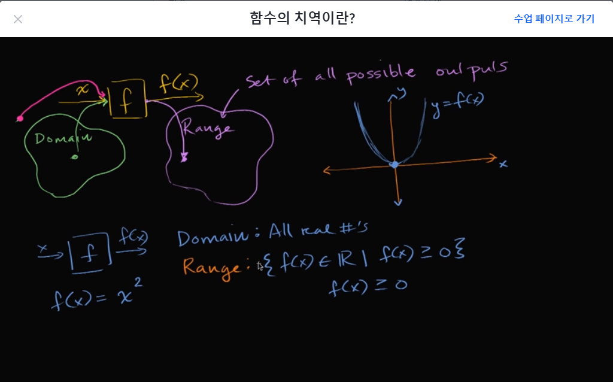

# [Algrebra] 함수
## 함수 계산하기
- 함수 : input => function => output
- f(x) = 49 - x²
  - f(5) = 49 - 25
  - f(5) = 24

## 함수와 방정식

### 방정식과 함수 차이
- 방정식 
  -  x+ 3 = 10
  - 식 자체를 말하는 것
- 함수 :
  - 그래프에 그려진 함수 관계
  - 변수 사이의 관계를 나타냄
- 방정식이면서 함수
  - y = 4x -10
  - y를 x에 대한 함수로 정의한 식
  - x를 대입하면 그에 대응하는 y값을 구할 수 있다.

### 방정식에서 함수식 구하기
- b에 대한 함수식을 구하면 a를 기준으로 계산해야 된다.
- 4a + 7b = -52
  - a = -13 - (7/4)b
  - f(b) = -13 - (7/4)b

## 함수의 정의역과 치역이란?

### 구간과 구간 표기법
- [x, y]는 괄호 안의 수를 포함O => 이상, 이하 : Closed Interval
- (x, y)는 괄호 안의 수를 포함X => 초과, 미만 : Open Interval
- (x, y]는 x초과 y미만 구간을 나타냄

### 함수의 정의역이란?(What is domain of a function?)
- 함수의 정의역 : 결과가 정의된 함수의 투입값들의 집합
  - the set of all inputs over which the function has defined outputs.

### 함수의 치역이란?(What is range of a function?)
- the set of all possible outputs

## 함수의 정의역 구하기

### 대수함수의 정의역

