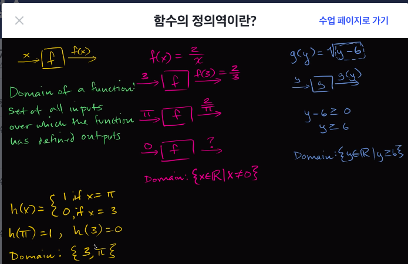
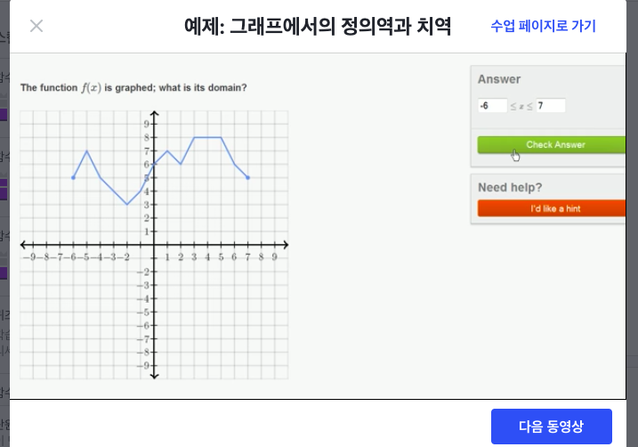
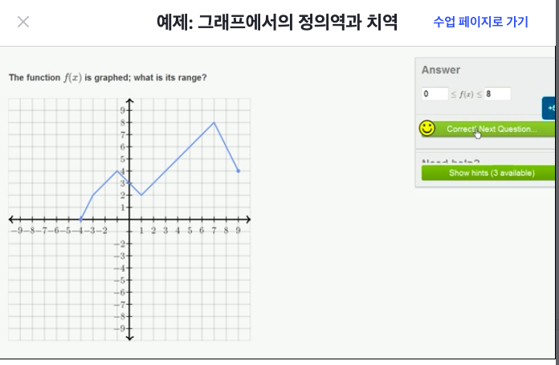

# [Algrebra] 함수
## 함수 계산하기
- 함수 : input => function => output
- f(x) = 49 - x²
  - f(5) = 49 - 25
  - f(5) = 24

## 함수와 방정식

### 방정식과 함수 차이
- 방정식 
  -  x+ 3 = 10
  - 식 자체를 말하는 것
- 함수 :
  - 그래프에 그려진 함수 관계
  - 변수 사이의 관계를 나타냄
- 방정식이면서 함수
  - y = 4x -10
  - y를 x에 대한 함수로 정의한 식
  - x를 대입하면 그에 대응하는 y값을 구할 수 있다.

### 방정식에서 함수식 구하기
- b에 대한 함수식을 구하면 a를 기준으로 계산해야 된다.
- 4a + 7b = -52
  - a = -13 - (7/4)b
  - f(b) = -13 - (7/4)b

## 함수의 정의역과 치역이란?

### 구간과 구간 표기법
- [x, y]는 괄호 안의 수를 포함O => 이상, 이하 : Closed Interval
- (x, y)는 괄호 안의 수를 포함X => 초과, 미만 : Open Interval
- (x, y]는 x초과 y미만 구간을 나타냄

### 함수의 정의역이란?(What is domain of a function?)
- R: 실수(Real Numbers)
- 정의역: 결과가 정의된 함수의 대입값들의 집합
  - Domain : the set of all valid inputs
- g(y) = √(y-6)
  - 음수가 나오지 않는 한 y를 넣었을때 g(y)라는 값이 나온다
    - 음수이면 루트 연산자의 원칙이 정의되지 않음
  - y-6은 0보다 크거나 같음 (y-6 ≥ 0)
  - 즉 y는 6보다 크거나 같음 (y ≥ 6)
  - 정의역 : {y ∈ R| y ≥ 6}

- 함수의 정의역에 신경써야 하는 이유
  - 함수가 모든 실수, 정수, 양수, 음수의 부분집합에 대해 정의되지 않고 제외되는 것이 있기 때문

### 함수의 치역이란?(What is range of a function?)
- the set of all possible outputs
- 치역 : 가능한 모든 출력값들의 모음
  - Range: the set of all possible outputs
- f(x) = x²
  - 정의역 : 모든 실수
  - 치역 : {f(x) ∈ R | f(x) ≥ 0}
    - f(x)는 0보다 크다

## 예제: 그래프에서의 정의역과 치역

- 위 그래프에서는 x가 -6일때부터 7일떄까지 정의되어있음
- 그래프에서 선이 없는 부분은 정의되지 않은 것
  - x가 -8일때 보면 선이 없으므로 f(-8)은 undefined
- 정의역: -6 ≤ x ≤ 7
  - 그래프에서 정의역은 x값의 범위 구한다고 생각

- 위 그래프에서 y가 가장 작은 값은 0이고 가장 큰값은 8임
- 치역: 0 ≤ x ≤ 8
  - 그래프에서 치역은 y값의 범위를 구한다고 생각

## 함수의 정의역 구하기
- g(x)= √(x+3)
  - 제곱근 함수는 음수의 제곱근으로 만드는 값을 제외한 모든 실수에 대해 성립
  - x+3 ≥ 0 -> x ≥ -3
- h(x)=(x-3)²
  - 이차함수는 모든 실수에 대해 정의
  - 이차함수의 정의역은 x의 모든 실숫값
- h(x)= 4/x−5	
  - 유리함수는 분모를 0으로 만드는 값(0으로 나누는 것)을 제외한 모든 실수에 대해 성립
  - 유리함수의 정의역은 x≠5인 모든 실수

### 대수함수의 정의역

