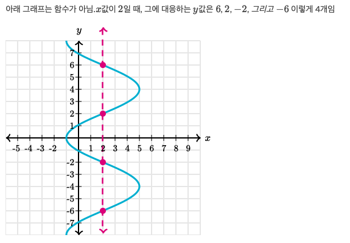

# [Algrebra] 함수

## 함수의 정의역 구하기
- g(x)= √(x+3)
  - 제곱근 함수는 음수의 제곱근을 제외한 모든 실수에 대해 성립
  - 즉 음수의 제곱근은 정의역에 속하지 않음
  - x+3 ≥ 0 -> x ≥ -3
- h(x)=(x-3)²
  - 이차함수는 모든 실수에 대해 정의
  - 이차함수의 정의역은 x의 모든 실숫값
- h(x)= 4/x−5	
  - 유리함수는 분모를 0으로 만드는 값(0으로 나누는 것)을 제외한 모든 실수에 대해 성립
  - 유리함수의 정의역은 x≠5인 모든 실수 성립

## 함수 구별하기

### 그래프를 이용해 함수 구별하기

- 그래프상의 모든 x값에 오직 하나의 y값이 대응한다면 함수 그래프
  - 만약 x값에 두 개 이상의 y값이 대응한다면 그 그래프는 함수가 아님

  

  

### 표를 보고 함수 구별하기

- 

## 최대점과 최소점

## 양수, 음수, 증가, 감소하는 함수의 구간

## 그래프의 특징 해석하기

## 