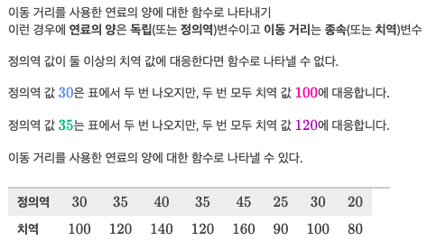

# [Algrebra] 함수

## 함수의 정의역 구하기
- g(x)= √(x+3)
  - 제곱근 함수는 음수의 제곱근을 제외한 모든 실수에 대해 성립
  - 즉 음수의 제곱근은 정의역에 속하지 않음
  - x+3 ≥ 0 -> x ≥ -3
- h(x)=(x-3)²
  - 이차함수는 모든 실수에 대해 정의
  - 이차함수의 정의역은 x의 모든 실숫값
- h(x)= 4/x−5	
  - 유리함수는 분모를 0으로 만드는 값(0으로 나누는 것)을 제외한 모든 실수에 대해 성립
  - 유리함수의 정의역은 x≠5인 모든 실수 성립

## 함수 구별하기

### 그래프를 이용해 함수 구별하기

- 그래프상의 모든 x값에 오직 하나의 y값이 대응한다면 함수 그래프
  - 만약 x값에 두 개 이상의 y값이 대응한다면 그 그래프는 함수가 아님

  

  

### 표를 보고 함수 구별하기

- 

## 최대점과 최소점
- 최대값(Maximum Point): 그래프에 있는 모든 점들 중 가장 높은 곳에 있는 점(1개)
- 최소값(Minimum Point): 그래프에 있는 모든 점들 중 가장 낮은 곳에 있는 점(1개)
- 극댓값: 어떤 점에서의 함숫값이 그 주변 점들의 함숫값보다 클 때(여러개 가능)
- 극소값: 어떤 점에서의 함숫값이 그 주변 점들의 함숫값보다 작을 때(여러개 가능)

## 양수, 음수, 증가, 감소하는 함수의 구간
- 그래프에서 곡선 방향이 아래인지 위인지 보고 고르면 됨

## 그래프의 특징 해석하기

- x절편: 함수S(w)와 S(w)=0인 x축이 만나는 지점
  - 그래프에서 x절편은 (320,0)
  - 인간의 눈은 파장이 320 나노미터일 때 감지하지 못한다.
- 극댓값(극솟값): 구간 내에서 주변에 있는 모든 점들보다 높거나(낮은) 점
  - 극댓값은 w=560
  - 인간의 눈은 파장이 560나노미터일 때 가장 감도가 높다.
- 증가구간(감소구간): 대입 값이 증가함에 따라 함숫값이 증가(감소)하는 정의역 구간
  - 이 그래프에서 구간 [560,800]은 감소구간입
  - 파장이 560 나노미터를 넘었을 때 인간의 눈의 감도는 점점 떨어진다.

