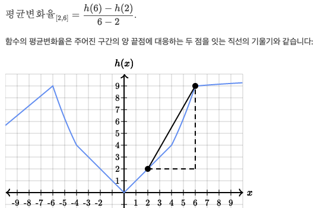
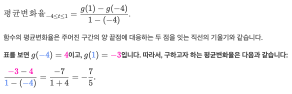

## 평균변화율

- 평균변화율이 양의 값: 구간의 시작점의 함숫값이 끝점의 함숫값보다 작을 경우 
- 평균변화율이 음의 값: 구간의 시작점의 함숫값이 끝점의 함숫값보다 클 경우 
- 평균변화율[a,b] = f(b)-f(a) / b-a
  - 
- 구간 a ≤ t ≤ b에서 함수 f의 평균변화율: 구간의 함숫값의 총 변화량(구간의 양 끝 함숫값의 차)을 구한 뒤, 그 값을 구간의 길이로 나눈다.
  - 
