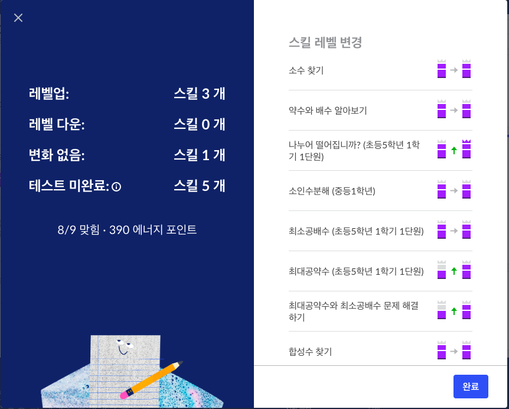

# [Pre-algrebra] 약수와 배수

## 참고
- 자연수: 0 포함
- 정수: 0 제외
- 약수: 어떤 수를 나머지 없이 나눌 수 있는 수

## 배수(mutiple number)

### [2,3,4,5,6,9,10]의 배수판정법

- 2: 짝수인지 체크
  - 2,799,588 = 가능

- 3: 모든 자릿수를 더하고 나온수를 3으로 나눠봄
  - 2,799,588 -> 2+7+9+9+5+8+8
  - = 48 -> 48/3은 나눠떨어지므로 3으로 나눌수 있음

- 4: 맨뒤 두자리수를 4로 나눠본다.
  - 2,799,588 -> 88 /4 = 가능
 
- 5: 끝자리가 0이나 5로 나눠진다
  - 2,799,588 = 불가능

- 6: 2와 3으로 나눌수 있는수(6을 소인수분해 하면 2와 3)
  - 2,799,588 = 가능

- 9: 모든 자릿수를 더하고 나온수를 9로 나눠봄
  - 2,799,588 -> 48/9 = 불가능
  - 3으로 나눠지지 않는 수는 9로도 안나눠진다.

## 3의 배수판정법의 원리
- 498 -> 4+9+8 = 21 / 3 = 3의 배수다
  - 이것의 원리는 각자리수를 9를 이용해 표기하는 것이다
  - 400 + 90 + 8
  - 4(1+99) + 9(1+9) + 8
  - 4(99) + 9(9) + 4 + 9 + 8
  - 4 + 9 + 8 has to by divide by 3!

## 어떤 수의 약수(factor) 찾기
- 어떤수의 약수라는건 그 어떤수가 나눌수의 배수라는 것이다.
- 154의 약수는 14

## 소수(Prime Number)
- 컴퓨터의 암호화는 소수 개념에 기반하고 있다.
- 소수는 자연수이며 소수의 약수는 1과 자기자신이다
  - Divisible by exatly 2 natural numbers(1 & it self)

- 1은 2개의 수로 나눠질수가 없으므로 소수가 아니다.
- 2는 1과 2로 나눠진다.(유일하게 짝수인 소수)
  - 그외의 짝수는 2로도 나눠지기 때문에 소수가 될 수 없다.(2 is only even prime number)
- 3 -> 1 & 3
- 5 -> 1 & 5
- 7 -> 1 & 7

## 소수(Prime)와 합성수(Composite)
- 소수: 1과 자신을 약수로 가지는 자연수
- 합성수: 1과 자신외에 다른 수를 약수로 가지는 자연수(1과 소수가 아닌수)
- 소수도 합성수도 아닌수 -> 1

## 소인수 분해(prime factorization)
- 지수 표기법(exponential notation) : 반복되는 소수를 작성할때는 지수로 작성하는 것
  - 3.14 = 314 * 10**-2 = 314e-2 
  - 프로그래밍에서는 ^이 아니라 **
- Find the prime factorization of 75 and 
- Write your answer using exponential notation
- 75 = 3 * 5 * 5 -> 3 * 5^2

## 공약수(common factor)
- 12와 20의 최소공배수 구하기
  - 12 = 2 * 2 * 3
  - 20 = 2 * 2 * 5
  - 중복 수 제거하고 곱한 결과 -> 2 * 2 * 3 * 5 = 60
-  2 * 2 * 3 * 5 이 4개의 조합으로 만들수 있는수가 공약수

## 최소공배수(least comoon multiple)
- 공통적으로 곱해서 나올 수 있는 수중에 가장 작은 수
- lcm(30, 25)
- 2 * 3 * 5 && 5 * 5
- 2 * 3 * 5 * 5 = 150

## 최대공약수(greatest common divisibility)
- 공통적으로 나눌 수 있는 수 중에 가장 큰 수
- 방법1. 각수의 모든 약수를 적은 후 가장 큰 수
  - gcd(10, 7)
  - 10 -> 1,2,5,10
  - 7 -> 1,7
  - 최대공약수는 1
 - 방법2. 소인수에 공통약수를 찾음. 그 수가 여러개면 수인수들의 곱  
  - gcd(21, 30)
    - 21 -> 3, 7
    - 30 -> 2, 3, 5  
    - 최대공약수: 공통되는 소인수 중에 가장 큰 수 3
  - gcd(105, 30)
    - 105 -> 5 * 3 * 7 -> 15 * 7
    - 30 -> 3 * 2 * 5 -> 15 * 2
    - 최대공약수: 공통되는 소인주 3과 5의 곱인 15

### 문제
- gcd(110,40,120)
  - 2 5 11
  - 2 2 2 5 
  - 2 2 2 3 5
  - -> 2 5

- gcd(35, 6)
  - -> 1

### 느낌점
- 미국식 수학은 표기하는 방식부터 프로그래밍이랑 비슷하다.
- 우리나라 명칭은 한문이라 봐도 뭔소린지 모르겠는데 미국 명칭은 보면 알겠다

