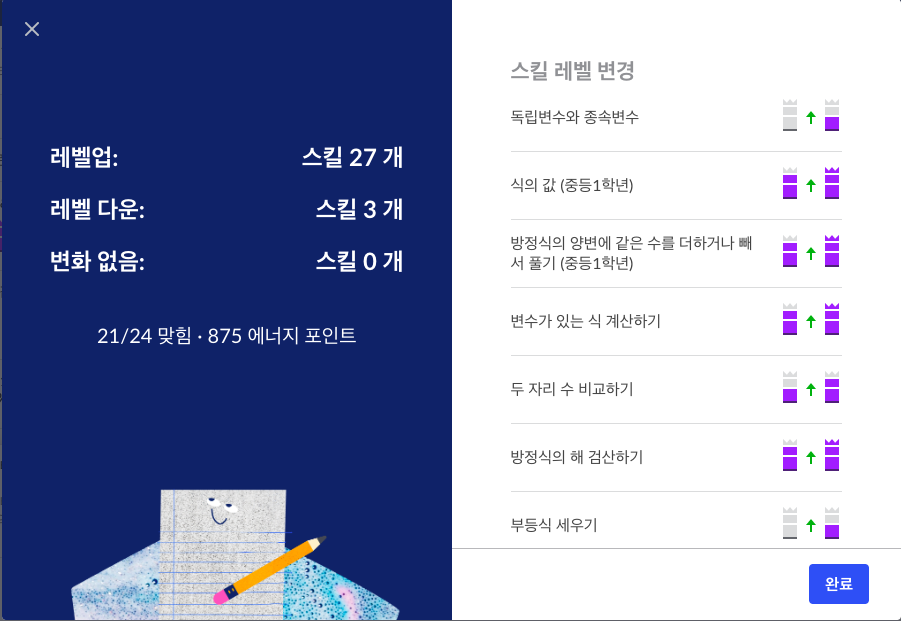

# [Pre-algrebra] 식, 방정식과 부등식

## 변수 variable
- 변하는 값, 주로 x를 사용한다.
- 대수학에서는 곱하기를 변수 x랑 헷갈린다는 이유때문에 사용하지 않는다.
- 대수학에서 2 곱하기 x를 표현하는 방법
  - 2·x, 2(x), 2x

- xy - y + 3x의 값, 단 x=3, y2
  - = 6 - 2 + 9
  - = 13
- 7j + 5 - 8k의 값 단 j=0.5
  3.5 + 5 - 2
  6.5

## 식의값
- 정수에 미지수를 곱하거나 더하면 -> 미지수 값이 증가하면 결과값도 증가
- 정수에 미지수를 나누거나 빼면 -> 미지수 값이 증가하면 결과값은 감소
- 위의 케이스로 모든 경우의 수가 나오는 것임

## 수식 만들기
- 괄호가 있는 식의 계산은 없는 식과 연산순서가 다르므로 결과가 다르게 나옴

## 식 계산하기
- 화씨온도(F)를 섭씨온도(C) 이용해서 구하기
  - F = 9 / 5 * C + 32
- 직육면체 겉넓이는 6x^2
  - 모서리 길이가 2라면 6(2^2) = 24

## 식 세우기
- 연산결과가 아닌 연산 결과가 나오는 식만 작성

## 방정식 문제 해결하기 : 요가
- S = session per month
- C = monthly cost
- Basic Plan: 
  - $20 per month
  - $8 per session
  - C = 20+8S

| S | C  |
| --| -- |
| 0 | 20 |
| 1 | 28 |
| 2 | 36 |
| 3 | 44 |

- Trial Plan
  - $12 per session
  - C = 12S

## 독립변수와 종속변수
- 독립변수: 어떤 실험에서 실험자가 직접 변경하는 변수로 대부분의 경우 x로 표시
- 종속변수: 독립변수의 값이 변함에 따라 달라지는 수량을 나타내는 변수로 등식에서는 대부분의 경우 y로 표시
- 용돈을 벌기 위해 집안일 한 개당 용돈 $3를 받음
  - 독립변수 : 집안일 양
  - 종속변수 : 집안일 해서 버는 용돈
  - y = 3x

