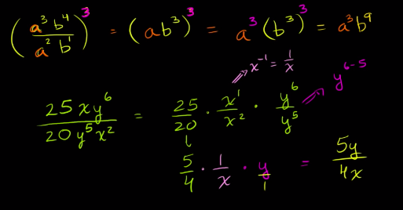
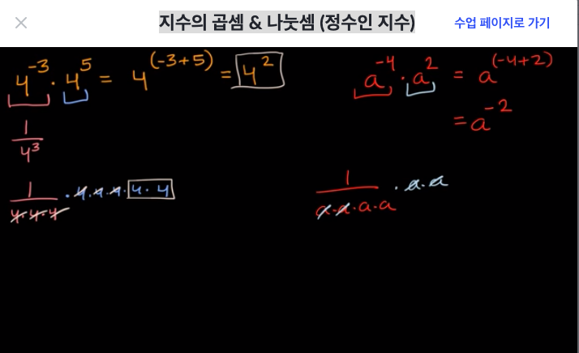
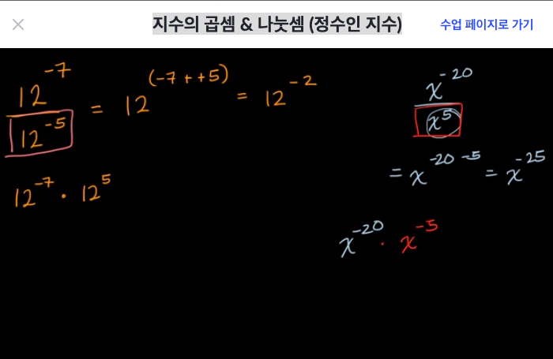
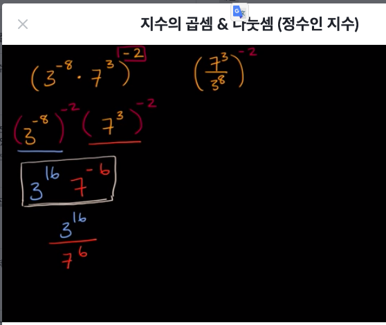
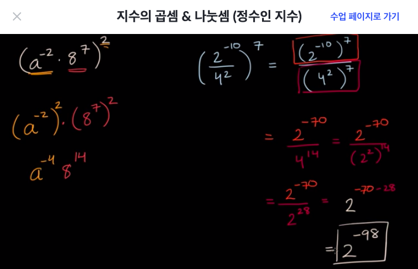

# [Pre-algrebra] 지수, 근호, 유효숫자 표기법

## 지수 exponents
- 어떤 수의 제곱은 1에서부터 시작하여 위에 있는 숫자만큼 곱해주는 것이다.
- 따라서 0을 제외한 어떤 수의 0의 제곱은 1이다. 
  - x^0 = 1

### 2^0 = 1 인 이유
- 2^3 -> 1·2·2·2 = 8
- 2^2 -> 1·2·2 = 4
- 2^1 -> 1·2 = 2
- 2^0 = 1

### -1의 제곱
- -1^0 = 1
- -1^1 -> 1·-1 = -1
- -1^2 -> 1·-1·-1 = 1
- -1^3 -> 1·-1·-1 = -1
- -1^4 -> 1·-1·-1·-1·-1 = 1
- 음수는 홀수의 제곱은 홀수 양수의 제곱은 양수가 나온다.

### 0^0
- undefined

### 소수의 지수
- 0.2^3 -> 1·0.2·0.2·0.2 = 0.008

### 지수를 포함한 변수로 이루어진 식
- 5^x - 3^x for x=2
  - 25 - 9 = 16
- y^2 - x^4 when y=9 and x=2
  - 81 - 16 = 65

---

## 제곱근 square root [JS: Math.sqrt()]
- x^2 = 9 -> x는 3 or -3
- √9 = x -> x는 오직 3
- ±√9 = x -> x는 3 or -3

### 소수 셋째 자리에서 반올림하여 제곱근의 근삿값 나타내기
- √45sms √36(6)보다 크고 √49(7)보다 작다.
- 6.71·6.71 = 45.0241

### 제곱근 간단히 하기
- 5√117
  - 117 인수 분해: 1+1+7 = 9 -> 117은 3으로 나눠지는 수
  - 5√(3·3·13) -> 5·3·√13 = 15√13
- 3√26
  - 26은 인수분해해서 제곱을 만들 것이 없음 = 3√26
- √450
  - 450 인수 분해: 2·25·9
  - √2·15

---

## 세제곱근 cube root (고등 수Ⅱ)

### ## 세제곱근의 기원
- 제곱근 구하는 것은 정사각형(square) 넓이가 있을 때 한변의 길이를 구하는데서 출발함
  - 넓이가 49인 정사각형의 한변의 길이는 √49 -> 7
- 세제곱근 구하는 것은 정육면체 넓이가 있을 때 한변의 길이를 구하는데서 출발함
  - 넓이가 27인 정육면체(cube)의 한변의 길이는  ³√27 -> 3
- ³√-64
  - 허수를 알기 전에 근호 안의 수가 음수일 경우는 정의할 수 없다
  - 일단 구해보면 -64를 인수분해하면 -> -4·-4·-4 
  - ³√-64 = -4

### 완전세제곱이 아닌 수의 세제곱근
- ³√3430
  - 3430 소인수분해 -> 2·5·7·7·7 -> ³√10·7 = 7³√10

### 세제곱근 간단히 하기
- ³√-343
  - ³√-1·³√(7·7·7) = -7

### 예제: 음수의 세제곱근
- ³√-512 
  - -1·³√(8·8·8) = -8

---

## 지수법칙 

### 곱셈에서의 지수법칙
- x^a·x^b = x^a+b
- (xy)^a = x^a·y^a
- (x^a)^b = x^a·b
- (2xy^2)(-1x^2y)^2(3x^2y^2)
  - 2·3·x·x^4·x^2·y^2·y^2·y^2
  - 6x^7y^6
- 0이 아닌 어떤 수에 0 제곱(power)은 1이다.

|`power`|0|1|2|3|
|:-:|-|-|-|-|
|`3`|1|3|9|27|

### 괄호가 있는 지수법칙
- 괄호 안의 수에 지수를 제곱해준 결과와 같다
    - (ab)^4 = (ab)(ab)(ab)(ab) = a^4·b^4
- 어떤 수의 제곱을 하고 또다시 몇제곱을 하면 그 값의 지수는 두 지수의 곱이다.
    - (a^b)^c -> a^(b·c) = a^(bc)
    - (a^3)^2 -> a^3·a^3 -> a^(3+3) = a^6

### 나눗셈에서의 지수법칙
- 어떤 수의 음의 제곱을 하면 어떤수 제곱분의 1이랑 같다
    - a^-b = 1/a^b
    - 5^6/5^2 -> 5^(6-2) = 5^4
    - (3^4)/(3^10) -> 1/3^6 = 3^-6

## 음의 지수 (고등 수Ⅱ)
- 거듭제곱의 지수가 음수이면, 지수의 부호가 양수인 거듭제곱의 역수와 같다.
    - x^-n=1/x^n 
​	

### 음의 지수 살펴보기
- x^n / x^m = x^(n-m)
- 2^2 / 2^3 = 2^-1

### 지수의 곱셈 & 나눗셈 (정수인 지수)

- (5^3·5^2)^4
- (5^(3+2))^4 -> (5^5)^4
- 5^20