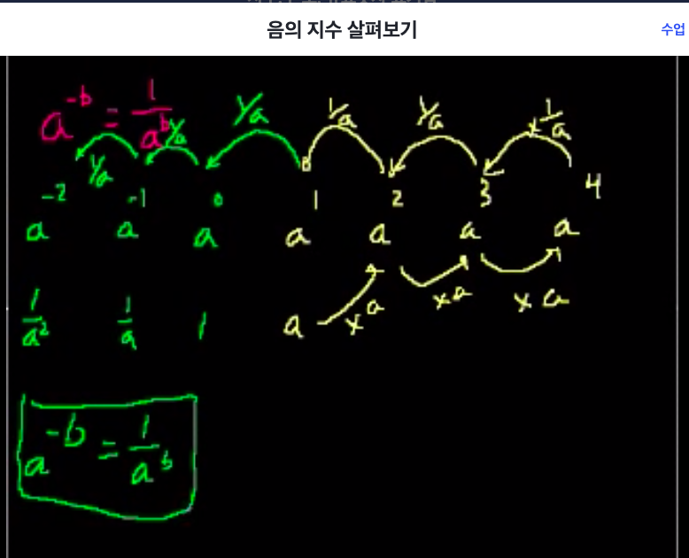
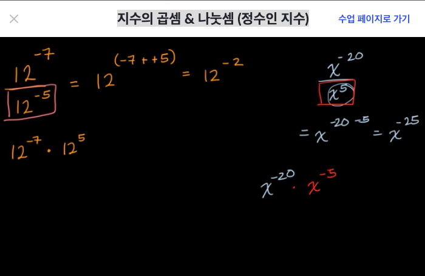
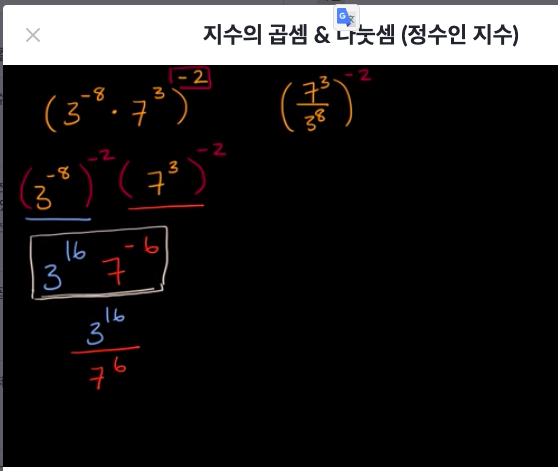

- 집에서 푸시안해서 충돌 안내려고 여기에 올림

### 괄호가 있는 지수법칙
- 괄호 안의 수에 지수를 제곱해준 결과와 같다
    - (ab)^4 = (ab)(ab)(ab)(ab) = a^4·b^4
- 어떤 수의 제곱을 하고 또다시 몇제곱을 하면 그 값의 지수는 두 지수의 곱이다.
    - (a^b)^c -> a^(b·c) = a^(bc)
    - (a^3)^2 -> a^3·a^3 -> a^(3+3) = a^6

### 나눗셈에서의 지수법칙
- 어떤 수의 음의 제곱을 하면 어떤수 제곱분의 1이랑 같다
    - a^-b = 1/a^b
    - 5^6/5^2 -> 5^(6-2) = 5^4
    - (3^4)/(3^10) -> 1/3^6 = 3^-6

## 음의 지수 (고등 수Ⅱ)
- 거듭제곱의 지수가 음수이면, 지수의 부호가 양수인 거듭제곱의 역수와 같다.
    - x^-n=1/x^n 
​	

### 음의 지수 살펴보기
- x^n / x^m = x^(n-m)
- 2^2 / 2^3 = 2^-1

### 지수의 곱셈 & 나눗셈 (정수인 지수)

- (5^3·5^2)^4
- (5^(3+2))^4 -> (5^5)^4
- 5^20